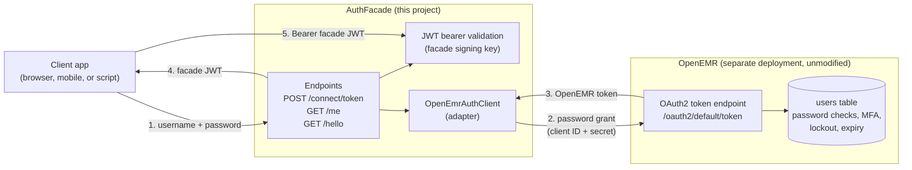
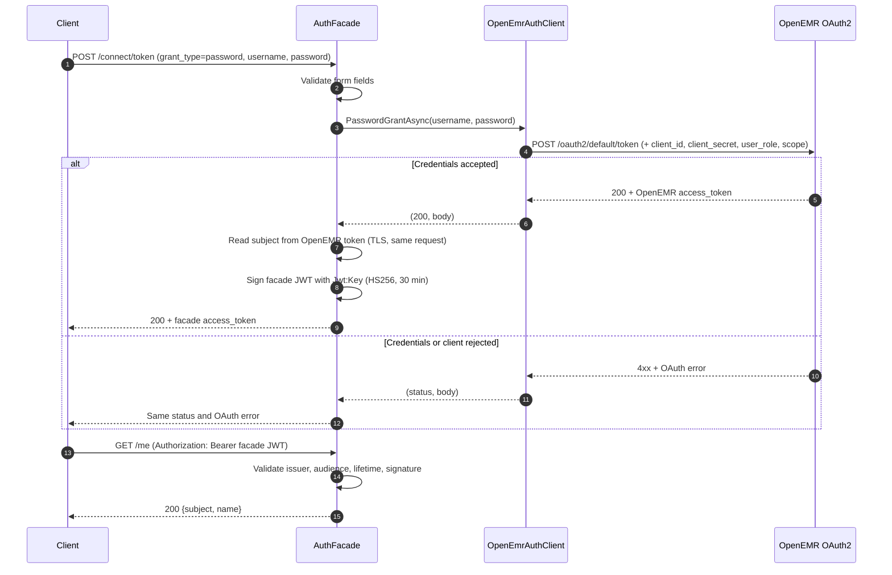

# Changelog 2026-10-10

## Summary

Built a development facade (`AuthFacade`) that sits in front of an OpenEMR instance. Clients log in through the facade, the facade validates credentials against OpenEMR's OAuth2 password grant, and it issues its own short-lived JWT. The work included several dead ends with OpenIddict, a registration bug in OpenEMR's client form, and a decision to keep OpenEMR's database unchanged. This entry records each decision and the reason for it.

## Added

- **`AuthFacade` ASP.NET Core minimal API** (`src/AuthFacade`), with these endpoints:
  - `POST /connect/token` accepts a password grant, forwards it to OpenEMR, and returns a facade-issued JWT on success.
  - `GET /me` requires a valid facade JWT and returns the subject and name.
  - `GET /hello` is a liveness check.
- **`OpenEmrAuthClient`** (`Services/OpenEmrAuthClient.cs`), a typed `HttpClient` wrapper around OpenEMR's `oauth2/default/token` endpoint. Client credentials come from configuration, never from source.
- **Docker development setup** for the facade: `Dockerfile` (.NET 10 SDK build, ASP.NET runtime image), `.dockerignore`, and `docker-compose.yml`. Secrets are read from a git-ignored `.env`, and `.env.example` documents the variable names.
- **OpenEMR development stack** (`docker/open-emr-legacy/`), using the pinned `openemr/openemr:8.0.0.3` image, a pinned MariaDB, and phpMyAdmin. It has no source bind mounts.
- **`TestFacade.ps1`**, a test script that prompts for the password, logs in through the facade, and calls `/me`. It prints status codes and property names, never tokens.
- **Ignore rules** for `.env`, build output, snapshots, OpenEMR sites data, and the upstream `docker/library` tree.

## Changed

- **Token issuing moved from OpenEMR passthrough to facade-issued tokens.** The first version returned OpenEMR's token to clients. The current version uses OpenEMR only to verify the login and returns its own token.
- **Dev compose file reduced** from the full OpenEMR CI stack (Selenium, CouchDB, LDAP, Mailpit, Xdebug, source mounts) to MariaDB, OpenEMR, and phpMyAdmin.
- **Configuration split by sensitivity.** Non-secret settings (`OpenEmr:BaseUrl`, `OpenEmr:Scope`) are in `appsettings.Development.json`. Secrets (`Jwt:Key`, `OpenEmr:ClientId`, `OpenEmr:ClientSecret`) are in user secrets on the host and in `.env` for Docker.

## Removed

- **`AuthApi` project** (OpenIddict server with EF Core stores, then a direct-database JWT prototype). Its replacement is `AuthFacade`.
- **`User.cs` and `OpenEmrDbContext`.** The redeclared `Id`, `Email`, and `Username` properties conflicted with `IdentityUser<Guid>`, and no new code needs Identity.
- **`LegacyUserAuthenticator`** (direct read of OpenEMR's `users` and `users_secure` tables with BCrypt verification). Replaced by delegating the login to OpenEMR's own OAuth2 server.
- **Hardcoded credentials** in `OpenEmrAuthClient`. The literals were removed, and the username and password now come from the request.

## Fixed

- **415 Unsupported Media Type** on `/connect/token`. Minimal API parameter binding was rejected before the handler ran. Reading the form from `HttpContext` resolved it.
- **Anti-forgery metadata error** on the token endpoint. Added `.DisableAntiforgery()`, since the endpoint serves API clients, not browser forms.
- **`MapInboundClaims`** remapped `sub` to `NameIdentifier`, which returned null from `/me`. Set it to `false`.
- **`HS256` key size error.** The container's `Jwt__Key` was 176 bits, below the 256-bit minimum. Regenerated a 48-byte key.
- **Port conflict on 7128.** A stale host `dotnet` process held `[::1]:7128`, so `localhost` requests never reached the container. Stopping the process resolved the misleading empty replies and 415s.
- **OpenEMR stack startup failures**, each with its own cause:
  - MariaDB TLS setup failed because the certificate files were missing. TLS was disabled for this local stack.
  - CouchDB failed because Docker created empty directories where files were expected. The bind mounts were removed.
  - OpenEMR composer errors came from mounting the wrong folder. The mount was pointed at the OpenEMR clone, and later source mounts were removed entirely.

## Decisions and justifications

**1. OpenIddict was tried first, then dropped.** OpenIddict's server requires EF Core stores (tables for applications, authorizations, and tokens). The constraint was to avoid adding tables to the existing OpenEMR database. Degraded mode and disabling token storage still called store code, so each workaround failed at a different point. OpenIddict is designed around its database store, and fighting that design cost more than it saved.

**2. Direct reads of OpenEMR's `users` table were rejected.** Verifying BCrypt hashes in the facade copies OpenEMR's login logic without its MFA, lockout, or password-expiry rules. It also creates a second credential store that can drift from OpenEMR. OpenEMR's OAuth2 server applies those rules, so the facade delegates to it.

**3. Facade-issued JWTs instead of OpenEMR tokens for `/me`.** Validating OpenEMR's tokens in the facade required fetching OpenEMR's JWKS and handling its self-signed certificate inside the JWT handler. That failed with "signature key not found," and the handler's startup configuration was fragile. Issuing a facade token after OpenEMR accepts the login keeps `/me` on a single, simple HMAC validation path. The tradeoff is that the facade becomes the token issuer its clients see.

**4. Facade pattern for the OpenEMR integration.** The facade gives clients one login endpoint and one token format, and hides OpenEMR's OAuth2 endpoints, client registration, and certificate details behind a single adapter (`OpenEmrAuthClient`). This keeps OpenEMR a separate, unmodified deployment, as the modernization plan requires. Feature code can then depend on the facade's interface rather than OpenEMR's API.

**5. OpenEMR runs as its own stack, not inside the project.** Copying OpenEMR into the project would turn upgrades into merge conflicts. The development compose file pins the image tag and talks to OpenEMR over the published port, so the facade and OpenEMR upgrade independently.

**6. Release image instead of the development image.** The `development-easy` build installs about 160 packages and copies roughly 32,000 files from a Windows bind mount on every first boot. The pinned release image starts from code already inside the image. First boot is still slow, and snapshots are a possible next step.

**7. Client registration remains manual for now.** The OpenEMR registration form has a JWKS bug: selecting system scopes causes it to submit the key set as a string. Registration works if no system scopes are selected. Automating registration needs OpenEMR's own client-creation code, not direct database inserts, because secret hashing and scope storage vary by version.

**8. Secrets are generated, never typed into chat.** Client secrets in OpenEMR are stored as hashes and can't be recovered, so the process should generate and store the secret in one step. Several credentials were pasted into the session during debugging. Those are treated as exposed and must be rotated.

## Security

- **Exposed credentials to rotate:** the OpenEMR admin password, the database passwords in the dev stack, the first client secret, the GitHub token that was hardcoded in the original compose file, and several access tokens. Revoke or change each one.
- **Development-only TLS bypass.** `DangerousAcceptAnyServerCertificateValidator` is applied only when the environment is `Development`. It must be replaced with a trusted certificate before any shared use.
- **Subject read without signature verification.** `/connect/token` reads the `sub` claim from OpenEMR's token using `ReadJwtToken`, which does not verify the signature. This is acceptable only because the token is received directly from OpenEMR over TLS in the same request. Do not reuse this pattern for client-supplied tokens.
- **Form values are never logged,** and the token endpoint does not echo OpenEMR's token body to clients.

## Known limitations and follow-ups

- Facade tokens last 30 minutes, with no refresh, revocation, or key rotation process.
- `/me` confirms identity only. Authorization for OpenEMR data is not yet implemented.
- The audience check is enforced, but the value is a fixed string, not a registered client.
- Client registration is manual. A bootstrap script should create the client through OpenEMR's own code and generate the secret itself.
- The `DataProtection` key warning in the container is expected for now. Persist keys before using the facade beyond local development.
- The first OpenEMR boot is slow. Consider a snapshot or pre-installed image for development.

## Diagrams

### Facade component view

### Login sequence

### Responsibilities

| Element | Responsibility |
|---|---|
| Client | Sends credentials to the facade only. Never talks to OpenEMR directly. |
| Facade endpoints | Validate input, coordinate the login, and issue the facade's own tokens. |
| `OpenEmrAuthClient` | Owns the OpenEMR URL, client credentials, scope, and token request format. |
| JWT validation | Checks facade tokens only. OpenEMR tokens are never accepted by clients. |
| OpenEMR | Authenticates users and enforces its own login rules. Remains a separate, unmodified deployment. |