# Clinical Care: UML diagrams

- **Part of:** the Clinical Care design set (`README.md` in this folder)
- **Depends on:** docs 01 to 06. The diagrams **draw** what those documents and the code say; where a diagram and the code disagree, the code wins and the diagram is the bug.

## 1. How to read this

- **Format:** Mermaid, so the diagrams render on GitHub and stay diff-able. Mermaid has no native UML *use case* or *component* diagram, so those are drawn as flowcharts in the usual notation.
- **Everything shown is built.** There are no target-state diagrams in this set.
- **Names** follow the code (`RecordVitalsUseCase`) and the glossary (doc 02). Class diagrams show the members that matter, not every property.
- **Syntax checked.** Every diagram in this set (these 19 and the one in doc 03) passes Mermaid 11.4.1's own parser, run in a browser on Nov 18; that check found and fixed three errors (a semicolon inside a sequence message, twice, and an extra colon in a state label). It checks syntax, not layout: GitHub's renderer may arrange a diagram differently.

| # | Diagram | UML kind | Shows |
|---|---|---|---|
| D1 | Actors and use cases | Use case | Who does what with the context |
| D2 | Project dependencies | Package / component | The layers and which may reference which |
| D3 | Runtime topology | Deployment | Containers, ports and the secrets between them |
| D4 | Encounter | Class | The aggregate, its facts, its identity, its token |
| D5 | Vitals | Class | The aggregate, quantities, units, BMI |
| D6 | Problems, allergies and issue links | Class | Two issue aggregates and the link |
| D7 | Immunization, SOAP note, clinical note | Class | The three remaining aggregates and their version kinds |
| D8 | Tokens, paging and errors | Class | `ConcurrencyToken`, `ContentVersion`, `PageRequest`, exceptions |
| D9 | One slice across the layers | Class | Use case, ports and adapters for recording vitals |
| D10 | Request path | Sequence | Browser to database through every station |
| D11 | Create an encounter | Sequence | Number allocation and the one transaction |
| D12 | Record vitals, retried | Sequence | The idempotency middleware's three outcomes |
| D13 | Correct vitals | Sequence | The version check, and the 412 |
| D14 | Delete vitals | Sequence | The permission check and the flag |
| D15 | `PatientRegistered` delivery | Sequence | Patient Management's relay to this service |
| D16 | FHIR search | Sequence | Strict parameters, paging, mapping |
| D17 | Idempotency claim | State | One key's life |
| D18 | Answering a conditional write | Activity | The order of 401, 428, 403, 404, 412, 400 |
| D19 | Tables | Entity-relationship | This service's own tables and the legacy tables it uses |

---

## 2. Structure

### D1. Actors and use cases

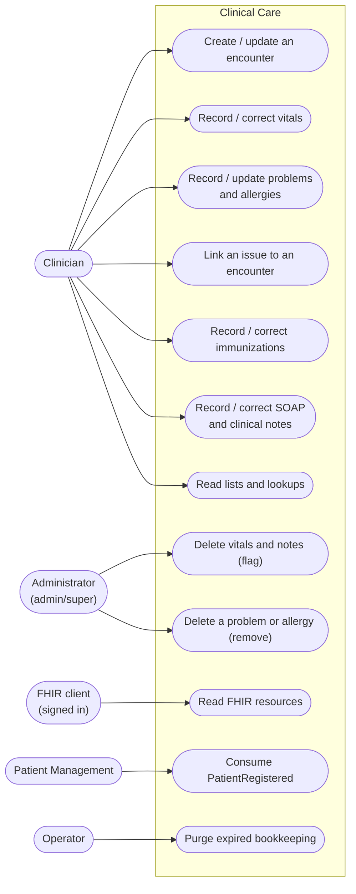
```mermaid
flowchart LR
    Clin(["Clinician"])
    Adm(["Administrator<br/>(admin/super)"])
    Fhir(["FHIR client<br/>(signed in)"])
    PM(["Patient Management"])
    Ops(["Operator"])

    subgraph CC["Clinical Care"]
        direction TB
        U1(["Create / update an encounter"])
        U2(["Record / correct vitals"])
        U3(["Record / update problems<br/>and allergies"])
        U4(["Link an issue to an encounter"])
        U5(["Record / correct immunizations"])
        U6(["Record / correct SOAP<br/>and clinical notes"])
        U7(["Read lists and lookups"])
        U8(["Delete vitals and notes (flag)"])
        U9(["Delete a problem or allergy (remove)"])
        U10(["Read FHIR resources"])
        U11(["Consume PatientRegistered"])
        U12(["Purge expired bookkeeping"])
    end

    Clin --> U1 & U2 & U3 & U4 & U5 & U6 & U7
    Adm --> U8 & U9
    Fhir --> U10
    PM --> U11
    Ops --> U12
```

### D2. Project dependencies

Arrows point from a project to what it may reference. The architecture tests fail the build if one is added the wrong way.

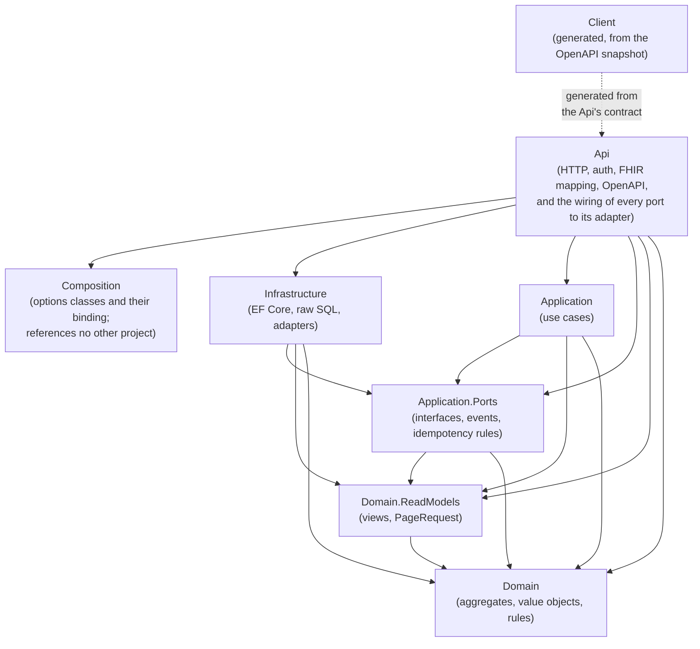
```mermaid
flowchart TB
    Api["Api<br/>(HTTP, auth, FHIR mapping, OpenAPI,<br/>and the wiring of every port to its adapter)"]
    Comp["Composition<br/>(options classes and their binding;<br/>references no other project)"]
    Infra["Infrastructure<br/>(EF Core, raw SQL, adapters)"]
    App["Application<br/>(use cases)"]
    Ports["Application.Ports<br/>(interfaces, events, idempotency rules)"]
    RM["Domain.ReadModels<br/>(views, PageRequest)"]
    Dom["Domain<br/>(aggregates, value objects, rules)"]
    Cli["Client<br/>(generated, from the OpenAPI snapshot)"]

    Api --> Comp
    Api --> Infra
    Api --> App
    Api --> Ports
    Api --> RM
    Api --> Dom
    Infra --> Ports
    Infra --> RM
    Infra --> Dom
    App --> Ports
    App --> RM
    App --> Dom
    Ports --> RM
    Ports --> Dom
    RM --> Dom
    Cli -. "generated from<br/>the Api's contract" .-> Api
```

Forbidden, and tested: `Domain` referencing any other project of this service; `Domain.ReadModels` referencing anything but `Domain`; `Application.Ports` referencing anything but `Domain` and `ReadModels`; `Application` referencing `Infrastructure` or `Api`; `Infrastructure` referencing `Application` or `Api`; `Composition` referencing `Api` or ASP.NET Core. The `Api` is the composition root: it is the only project that sees both a port and its adapter, so it is where they are tied together.

### D3. Runtime topology

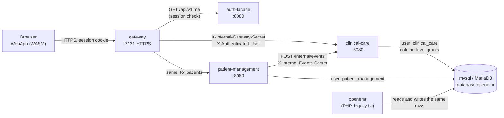
```mermaid
flowchart LR
    B["Browser<br/>WebApp (WASM)"]
    GW["gateway<br/>:7131 HTTPS"]
    AF["auth-facade<br/>:8080"]
    PMs["patient-management<br/>:8080"]
    CCs["clinical-care<br/>:8080"]
    OE["openemr<br/>(PHP, legacy UI)"]
    DB[("mysql / MariaDB<br/>database openemr")]

    B -- "HTTPS, session cookie" --> GW
    GW -- "GET /api/v1/me<br/>(session check)" --> AF
    GW -- "X-Internal-Gateway-Secret<br/>X-Authenticated-User" --> CCs
    GW -- "same, for patients" --> PMs
    PMs -- "POST /internal/events<br/>X-Internal-Events-Secret" --> CCs
    CCs -- "user: clinical_care<br/>column-level grants" --> DB
    PMs -- "user: patient_management" --> DB
    OE -- "reads and writes the same rows" --> DB
```

Clinical Care publishes no host port: the only ways in are the gateway (with its secret) and Patient Management's relay (with another).

---

## 3. Class diagrams

### D4. Encounter

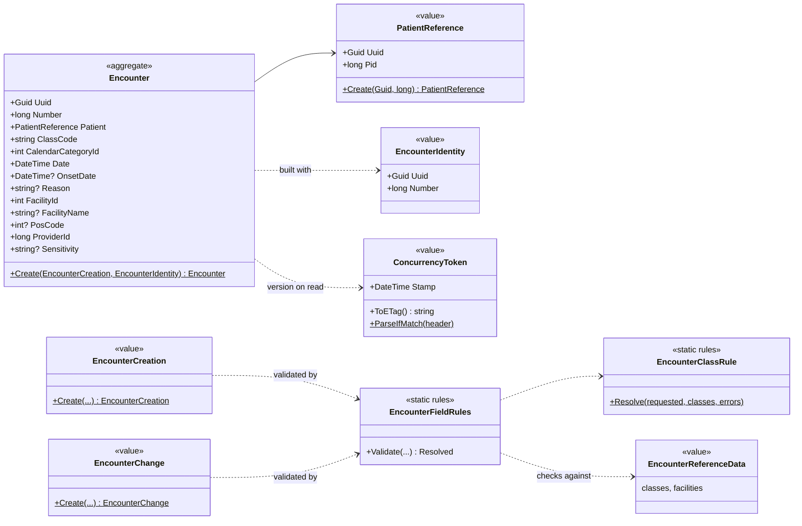
```mermaid
classDiagram
    direction LR
    class Encounter {
        <<aggregate>>
        +Guid Uuid
        +long Number
        +PatientReference Patient
        +string ClassCode
        +int CalendarCategoryId
        +DateTime Date
        +DateTime? OnsetDate
        +string? Reason
        +int FacilityId
        +string? FacilityName
        +int? PosCode
        +long ProviderId
        +string? Sensitivity
        +Create(EncounterCreation, EncounterIdentity)$ Encounter
    }
    class EncounterCreation {
        <<value>>
        +Create(...)$ EncounterCreation
    }
    class EncounterChange {
        <<value>>
        +Create(...)$ EncounterChange
    }
    class EncounterIdentity {
        <<value>>
        +Guid Uuid
        +long Number
    }
    class PatientReference {
        <<value>>
        +Guid Uuid
        +long Pid
        +Create(Guid, long)$ PatientReference
    }
    class EncounterReferenceData {
        <<value>>
        classes, facilities
    }
    class EncounterFieldRules {
        <<static rules>>
        +Validate(...) Resolved
    }
    class EncounterClassRule {
        <<static rules>>
        +Resolve(requested, classes, errors)$
    }
    class ConcurrencyToken {
        <<value>>
        +DateTime Stamp
        +ToETag() string
        +ParseIfMatch(header)$
    }

    Encounter --> PatientReference
    Encounter ..> EncounterIdentity : built with
    EncounterCreation ..> EncounterFieldRules : validated by
    EncounterChange ..> EncounterFieldRules : validated by
    EncounterFieldRules ..> EncounterClassRule
    EncounterFieldRules ..> EncounterReferenceData : checks against
    Encounter ..> ConcurrencyToken : version on read
```

### D5. Vitals

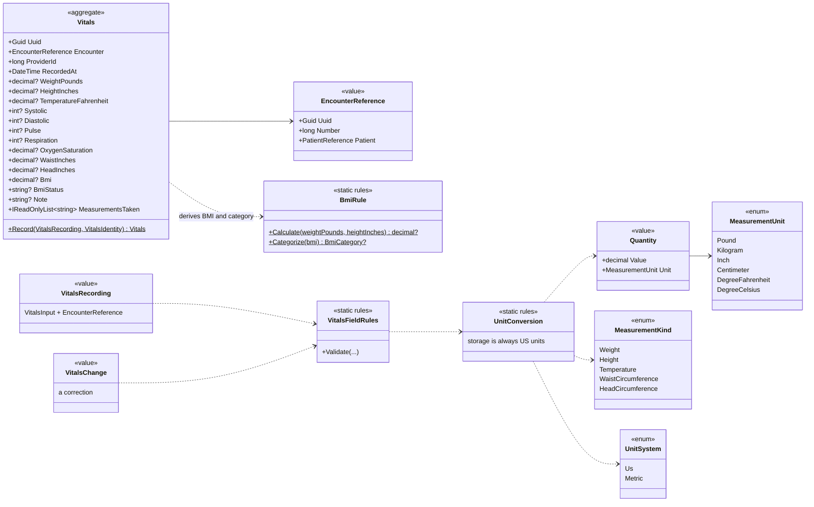
```mermaid
classDiagram
    direction LR
    class Vitals {
        <<aggregate>>
        +Guid Uuid
        +EncounterReference Encounter
        +long ProviderId
        +DateTime RecordedAt
        +decimal? WeightPounds
        +decimal? HeightInches
        +decimal? TemperatureFahrenheit
        +int? Systolic
        +int? Diastolic
        +int? Pulse
        +int? Respiration
        +decimal? OxygenSaturation
        +decimal? WaistInches
        +decimal? HeadInches
        +decimal? Bmi
        +string? BmiStatus
        +string? Note
        +IReadOnlyList~string~ MeasurementsTaken
        +Record(VitalsRecording, VitalsIdentity)$ Vitals
    }
    class VitalsRecording {
        <<value>>
        VitalsInput + EncounterReference
    }
    class VitalsChange {
        <<value>>
        a correction
    }
    class EncounterReference {
        <<value>>
        +Guid Uuid
        +long Number
        +PatientReference Patient
    }
    class Quantity {
        <<value>>
        +decimal Value
        +MeasurementUnit Unit
    }
    class MeasurementUnit {
        <<enum>>
        Pound
        Kilogram
        Inch
        Centimeter
        DegreeFahrenheit
        DegreeCelsius
    }
    class MeasurementKind {
        <<enum>>
        Weight
        Height
        Temperature
        WaistCircumference
        HeadCircumference
    }
    class UnitSystem {
        <<enum>>
        Us
        Metric
    }
    class BmiRule {
        <<static rules>>
        +Calculate(weightPounds, heightInches)$ decimal?
        +Categorize(bmi)$ BmiCategory?
    }
    class UnitConversion {
        <<static rules>>
        storage is always US units
    }
    class VitalsFieldRules {
        <<static rules>>
        +Validate(...)
    }

    Vitals --> EncounterReference
    Vitals ..> BmiRule : derives BMI and category
    VitalsRecording ..> VitalsFieldRules
    VitalsChange ..> VitalsFieldRules
    VitalsFieldRules ..> UnitConversion
    UnitConversion ..> Quantity
    Quantity --> MeasurementUnit
    UnitConversion ..> MeasurementKind
    UnitConversion ..> UnitSystem
```

### D6. Problems, allergies and issue links

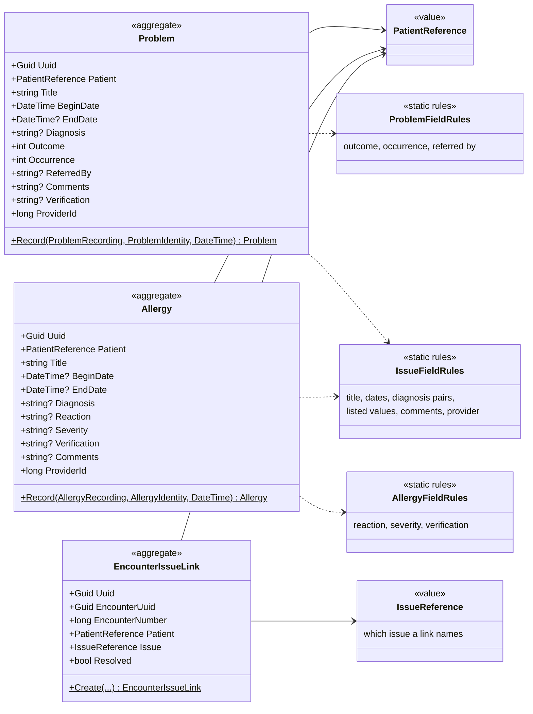
```mermaid
classDiagram
    direction LR
    class Problem {
        <<aggregate>>
        +Guid Uuid
        +PatientReference Patient
        +string Title
        +DateTime BeginDate
        +DateTime? EndDate
        +string? Diagnosis
        +int Outcome
        +int Occurrence
        +string? ReferredBy
        +string? Comments
        +string? Verification
        +long ProviderId
        +Record(ProblemRecording, ProblemIdentity, DateTime)$ Problem
    }
    class Allergy {
        <<aggregate>>
        +Guid Uuid
        +PatientReference Patient
        +string Title
        +DateTime? BeginDate
        +DateTime? EndDate
        +string? Diagnosis
        +string? Reaction
        +string? Severity
        +string? Verification
        +string? Comments
        +long ProviderId
        +Record(AllergyRecording, AllergyIdentity, DateTime)$ Allergy
    }
    class EncounterIssueLink {
        <<aggregate>>
        +Guid Uuid
        +Guid EncounterUuid
        +long EncounterNumber
        +PatientReference Patient
        +IssueReference Issue
        +bool Resolved
        +Create(...)$ EncounterIssueLink
    }
    class IssueReference {
        <<value>>
        which issue a link names
    }
    class IssueFieldRules {
        <<static rules>>
        title, dates, diagnosis pairs,
        listed values, comments, provider
    }
    class ProblemFieldRules {
        <<static rules>>
        outcome, occurrence, referred by
    }
    class AllergyFieldRules {
        <<static rules>>
        reaction, severity, verification
    }
    class PatientReference {
        <<value>>
    }

    Problem --> PatientReference
    Allergy --> PatientReference
    EncounterIssueLink --> PatientReference
    EncounterIssueLink --> IssueReference
    Problem ..> ProblemFieldRules
    Problem ..> IssueFieldRules
    Allergy ..> AllergyFieldRules
    Allergy ..> IssueFieldRules
```

Problems and allergies are both rows of legacy's one `lists` table, told apart by `type`; the two aggregates share `IssueFieldRules` and keep their own rules in their own classes.

### D7. Immunization, SOAP note, clinical note

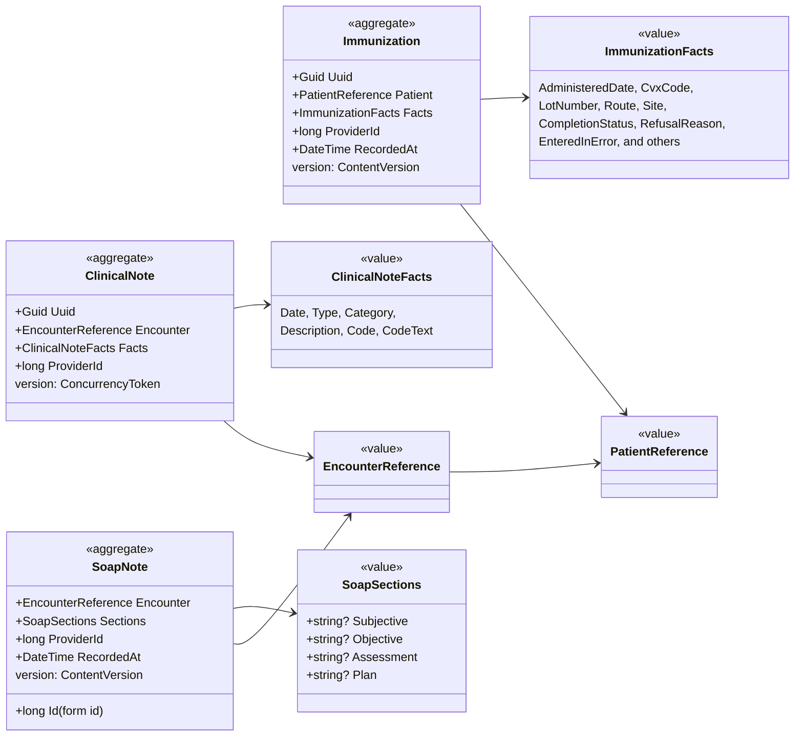
```mermaid
classDiagram
    direction LR
    class Immunization {
        <<aggregate>>
        +Guid Uuid
        +PatientReference Patient
        +ImmunizationFacts Facts
        +long ProviderId
        +DateTime RecordedAt
        version: ContentVersion
    }
    class ImmunizationFacts {
        <<value>>
        AdministeredDate, CvxCode,
        LotNumber, Route, Site,
        CompletionStatus, RefusalReason,
        EnteredInError, and others
    }
    class SoapNote {
        <<aggregate>>
        +long Id (form id)
        +EncounterReference Encounter
        +SoapSections Sections
        +long ProviderId
        +DateTime RecordedAt
        version: ContentVersion
    }
    class SoapSections {
        <<value>>
        +string? Subjective
        +string? Objective
        +string? Assessment
        +string? Plan
    }
    class ClinicalNote {
        <<aggregate>>
        +Guid Uuid
        +EncounterReference Encounter
        +ClinicalNoteFacts Facts
        +long ProviderId
        version: ConcurrencyToken
    }
    class ClinicalNoteFacts {
        <<value>>
        Date, Type, Category,
        Description, Code, CodeText
    }
    class EncounterReference {
        <<value>>
    }
    class PatientReference {
        <<value>>
    }

    Immunization --> PatientReference
    Immunization --> ImmunizationFacts
    SoapNote --> EncounterReference
    SoapNote --> SoapSections
    ClinicalNote --> EncounterReference
    ClinicalNote --> ClinicalNoteFacts
    EncounterReference --> PatientReference
```

### D8. Tokens, paging and errors

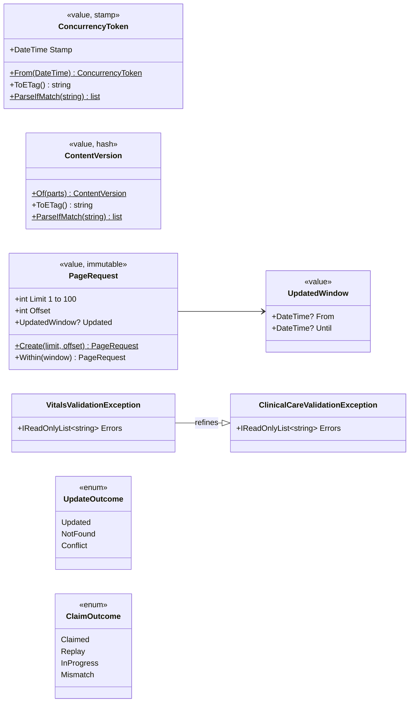
```mermaid
classDiagram
    direction LR
    class ConcurrencyToken {
        <<value, stamp>>
        +DateTime Stamp
        +From(DateTime)$ ConcurrencyToken
        +ToETag() string
        +ParseIfMatch(string)$ list
    }
    class ContentVersion {
        <<value, hash>>
        +Of(parts)$ ContentVersion
        +ToETag() string
        +ParseIfMatch(string)$ list
    }
    class PageRequest {
        <<value, immutable>>
        +int Limit  1 to 100
        +int Offset
        +UpdatedWindow? Updated
        +Create(limit, offset)$ PageRequest
        +Within(window) PageRequest
    }
    class UpdatedWindow {
        <<value>>
        +DateTime? From
        +DateTime? Until
    }
    class ClinicalCareValidationException {
        +IReadOnlyList~string~ Errors
    }
    class VitalsValidationException {
        +IReadOnlyList~string~ Errors
    }
    class UpdateOutcome {
        <<enum>>
        Updated
        NotFound
        Conflict
    }
    class ClaimOutcome {
        <<enum>>
        Claimed
        Replay
        InProgress
        Mismatch
    }

    PageRequest --> UpdatedWindow
    VitalsValidationException --|> ClinicalCareValidationException : refines
```

A stamp's `ETag` is the tick count in hex; a content version's starts `"c-`. Neither can be mistaken for the other, and a weak tag never matches under `If-Match`.

### D9. One slice across the layers: recording vitals

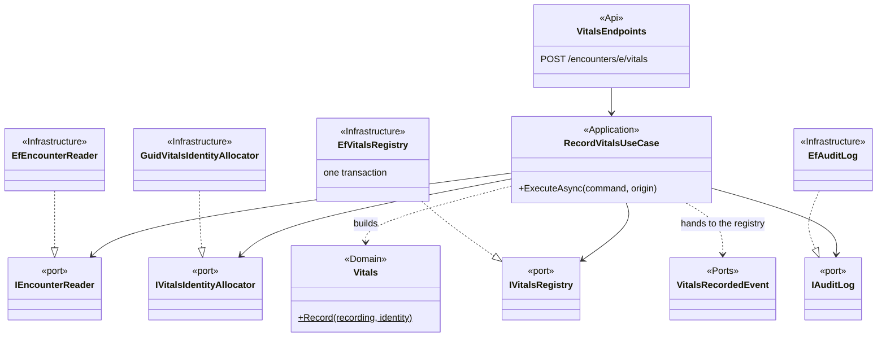
```mermaid
classDiagram
    direction TB
    class VitalsEndpoints {
        <<Api>>
        POST /encounters/e/vitals
    }
    class RecordVitalsUseCase {
        <<Application>>
        +ExecuteAsync(command, origin)
    }
    class IEncounterReader {
        <<port>>
    }
    class IVitalsIdentityAllocator {
        <<port>>
    }
    class IVitalsRegistry {
        <<port>>
    }
    class IAuditLog {
        <<port>>
    }
    class Vitals {
        <<Domain>>
        +Record(recording, identity)$
    }
    class VitalsRecordedEvent {
        <<Ports>>
    }
    class EfEncounterReader {
        <<Infrastructure>>
    }
    class GuidVitalsIdentityAllocator {
        <<Infrastructure>>
    }
    class EfVitalsRegistry {
        <<Infrastructure>>
        one transaction
    }
    class EfAuditLog {
        <<Infrastructure>>
    }

    VitalsEndpoints --> RecordVitalsUseCase
    RecordVitalsUseCase --> IEncounterReader
    RecordVitalsUseCase --> IVitalsIdentityAllocator
    RecordVitalsUseCase --> IVitalsRegistry
    RecordVitalsUseCase --> IAuditLog
    RecordVitalsUseCase ..> Vitals : builds
    RecordVitalsUseCase ..> VitalsRecordedEvent : hands to the registry
    EfEncounterReader ..|> IEncounterReader
    GuidVitalsIdentityAllocator ..|> IVitalsIdentityAllocator
    EfVitalsRegistry ..|> IVitalsRegistry
    EfAuditLog ..|> IAuditLog
```

Every slice has this shape: an endpoint, one use case, a few ports, and one adapter per port. The `Api` project wires each port to its adapter (`ClinicalCareApiExtensions`).

---

## 4. Sequence diagrams

### D10. Request path

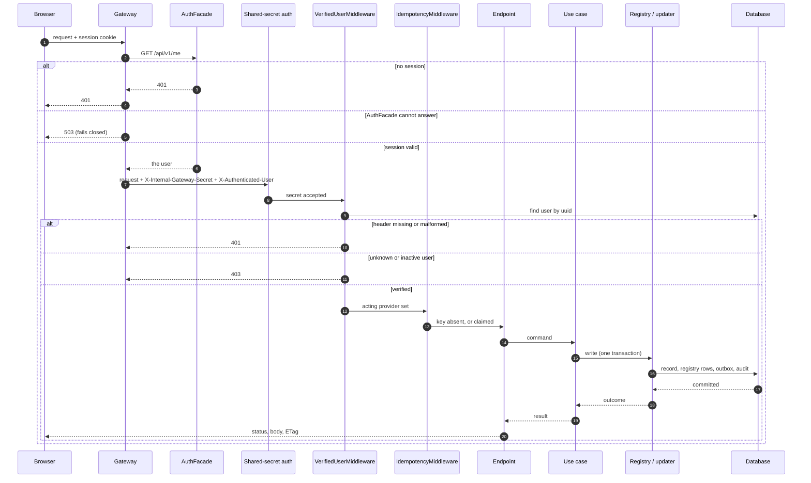
```mermaid
sequenceDiagram
    autonumber
    participant B as Browser
    participant G as Gateway
    participant A as AuthFacade
    participant S as Shared-secret auth
    participant V as VerifiedUserMiddleware
    participant I as IdempotencyMiddleware
    participant E as Endpoint
    participant U as Use case
    participant R as Registry / updater
    participant D as Database

    B->>G: request + session cookie
    G->>A: GET /api/v1/me
    alt no session
        A-->>G: 401
        G-->>B: 401
    else AuthFacade cannot answer
        G-->>B: 503 (fails closed)
    else session valid
        A-->>G: the user
        G->>S: request + X-Internal-Gateway-Secret + X-Authenticated-User
        S->>V: secret accepted
        V->>D: find user by uuid
        alt header missing or malformed
            V-->>G: 401
        else unknown or inactive user
            V-->>G: 403
        else verified
            V->>I: acting provider set
            I->>E: key absent, or claimed
            E->>U: command
            U->>R: write (one transaction)
            R->>D: record, registry rows, outbox, audit
            D-->>R: committed
            R-->>U: outcome
            U-->>E: result
            E-->>B: status, body, ETag
        end
    end
```

### D11. Create an encounter

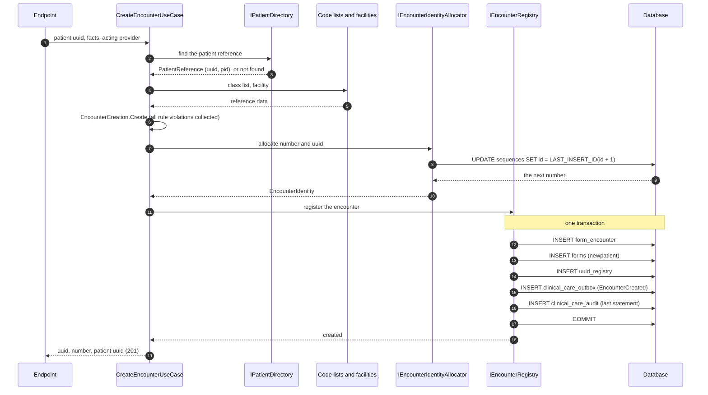
```mermaid
sequenceDiagram
    autonumber
    participant E as Endpoint
    participant U as CreateEncounterUseCase
    participant P as IPatientDirectory
    participant L as Code lists and facilities
    participant N as IEncounterIdentityAllocator
    participant R as IEncounterRegistry
    participant D as Database

    E->>U: patient uuid, facts, acting provider
    U->>P: find the patient reference
    P-->>U: PatientReference (uuid, pid), or not found
    U->>L: class list, facility
    L-->>U: reference data
    U->>U: EncounterCreation.Create (all rule violations collected)
    U->>N: allocate number and uuid
    N->>D: UPDATE sequences SET id = LAST_INSERT_ID(id + 1)
    D-->>N: the next number
    N-->>U: EncounterIdentity
    U->>R: register the encounter
    Note over R,D: one transaction
    R->>D: INSERT form_encounter
    R->>D: INSERT forms (newpatient)
    R->>D: INSERT uuid_registry
    R->>D: INSERT clinical_care_outbox (EncounterCreated)
    R->>D: INSERT clinical_care_audit (last statement)
    R->>D: COMMIT
    R-->>U: created
    U-->>E: uuid, number, patient uuid (201)
```

The registry first checks whether an earlier attempt of the same transaction already committed (the service retries transient faults), so a lost commit acknowledgement does not create a second encounter.

### D12. Record vitals, retried

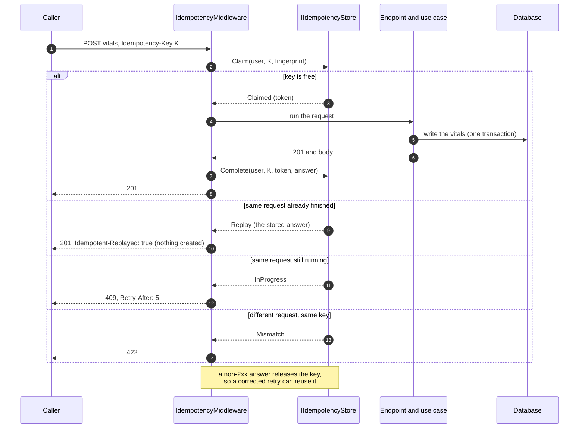
```mermaid
sequenceDiagram
    autonumber
    participant C as Caller
    participant I as IdempotencyMiddleware
    participant S as IIdempotencyStore
    participant E as Endpoint and use case
    participant D as Database

    C->>I: POST vitals, Idempotency-Key K
    I->>S: Claim(user, K, fingerprint)
    alt key is free
        S-->>I: Claimed (token)
        I->>E: run the request
        E->>D: write the vitals (one transaction)
        E-->>I: 201 and body
        I->>S: Complete(user, K, token, answer)
        I-->>C: 201
    else same request already finished
        S-->>I: Replay (the stored answer)
        I-->>C: 201, Idempotent-Replayed: true (nothing created)
    else same request still running
        S-->>I: InProgress
        I-->>C: 409, Retry-After: 5
    else different request, same key
        S-->>I: Mismatch
        I-->>C: 422
    end
    Note over I,S: a non-2xx answer releases the key,<br/>so a corrected retry can reuse it
```

### D13. Correct vitals

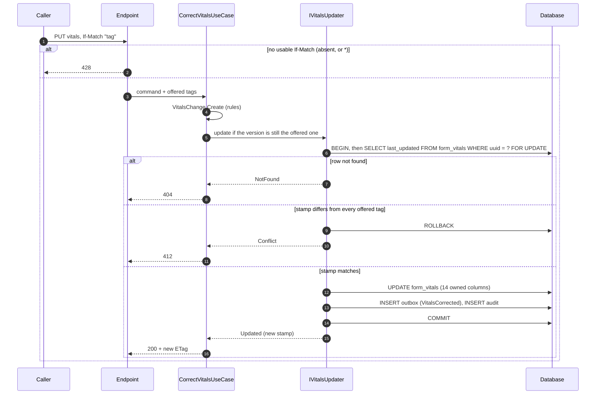
```mermaid
sequenceDiagram
    autonumber
    participant C as Caller
    participant E as Endpoint
    participant U as CorrectVitalsUseCase
    participant U2 as IVitalsUpdater
    participant D as Database

    C->>E: PUT vitals, If-Match "tag"
    alt no usable If-Match (absent, or *)
        E-->>C: 428
    else
        E->>U: command + offered tags
        U->>U: VitalsChange.Create (rules)
        U->>U2: update if the version is still the offered one
        U2->>D: BEGIN, then SELECT last_updated FROM form_vitals WHERE uuid = ? FOR UPDATE
        alt row not found
            U2-->>U: NotFound
            U-->>E: 404
        else stamp differs from every offered tag
            U2->>D: ROLLBACK
            U2-->>U: Conflict
            U-->>E: 412
        else stamp matches
            U2->>D: UPDATE form_vitals (14 owned columns)
            U2->>D: INSERT outbox (VitalsCorrected), INSERT audit
            U2->>D: COMMIT
            U2-->>U: Updated (new stamp)
            U-->>E: 200 + new ETag
        end
    end
```

The version is checked **under the row lock, in the same transaction as the write**, so a legacy edit that lands between the caller's read and this write is never overwritten unseen. A test calls the updater directly with a stale tag, because the use case's own check would otherwise hide a missing one.

### D14. Delete vitals

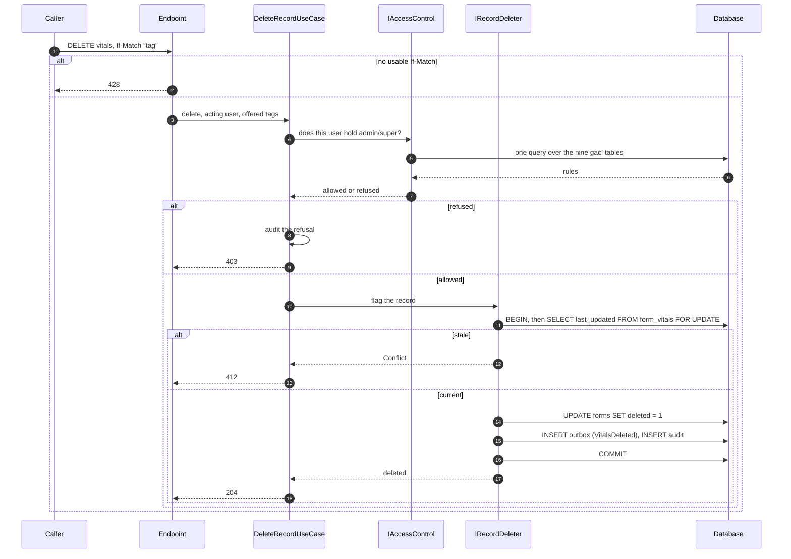
```mermaid
sequenceDiagram
    autonumber
    participant C as Caller
    participant E as Endpoint
    participant U as DeleteRecordUseCase
    participant X as IAccessControl
    participant R as IRecordDeleter
    participant D as Database

    C->>E: DELETE vitals, If-Match "tag"
    alt no usable If-Match
        E-->>C: 428
    else
        E->>U: delete, acting user, offered tags
        U->>X: does this user hold admin/super?
        X->>D: one query over the nine gacl tables
        D-->>X: rules
        X-->>U: allowed or refused
        alt refused
            U->>U: audit the refusal
            U-->>E: 403
        else allowed
            U->>R: flag the record
            R->>D: BEGIN, then SELECT last_updated FROM form_vitals FOR UPDATE
            alt stale
                R-->>U: Conflict
                U-->>E: 412
            else current
                R->>D: UPDATE forms SET deleted = 1
                R->>D: INSERT outbox (VitalsDeleted), INSERT audit
                R->>D: COMMIT
                R-->>U: deleted
                U-->>E: 204
            end
        end
    end
```

The 403 comes **before** any lookup, so someone who may not delete learns nothing about which records exist. The record is flagged, not removed; an administrator can restore it in OpenEMR.

### D15. `PatientRegistered` delivery

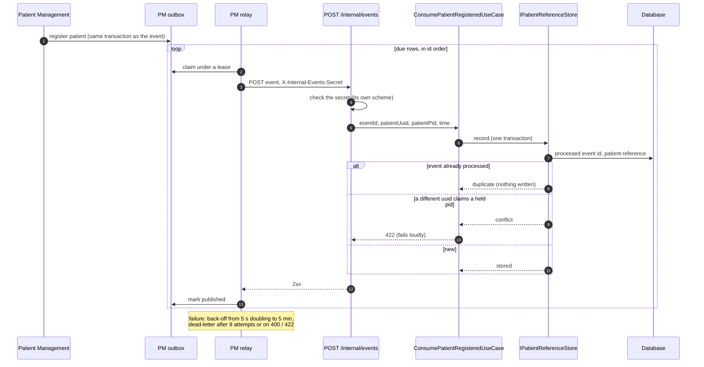
```mermaid
sequenceDiagram
    autonumber
    participant PM as Patient Management
    participant O as PM outbox
    participant RL as PM relay
    participant EP as POST /internal/events
    participant U as ConsumePatientRegisteredUseCase
    participant S as IPatientReferenceStore
    participant D as Database

    PM->>O: register patient (same transaction as the event)
    loop due rows, in id order
        RL->>O: claim under a lease
        RL->>EP: POST event, X-Internal-Events-Secret
        EP->>EP: check the secret (its own scheme)
        EP->>U: eventId, patientUuid, patientPid, time
        U->>S: record (one transaction)
        S->>D: processed event id, patient reference
        alt event already processed
            S-->>U: duplicate (nothing written)
        else a different uuid claims a held pid
            S-->>U: conflict
            U-->>EP: 422 (fails loudly)
        else new
            S-->>U: stored
        end
        EP-->>RL: 2xx
        RL->>O: mark published
    end
    Note over RL: failure: back-off from 5 s doubling to 5 min,<br/>dead-letter after 8 attempts or on 400 / 422
```

Until the event is applied, Clinical Care answers **404** for the new patient. The WebApp says "still being set up" and retries by itself.

### D16. FHIR search

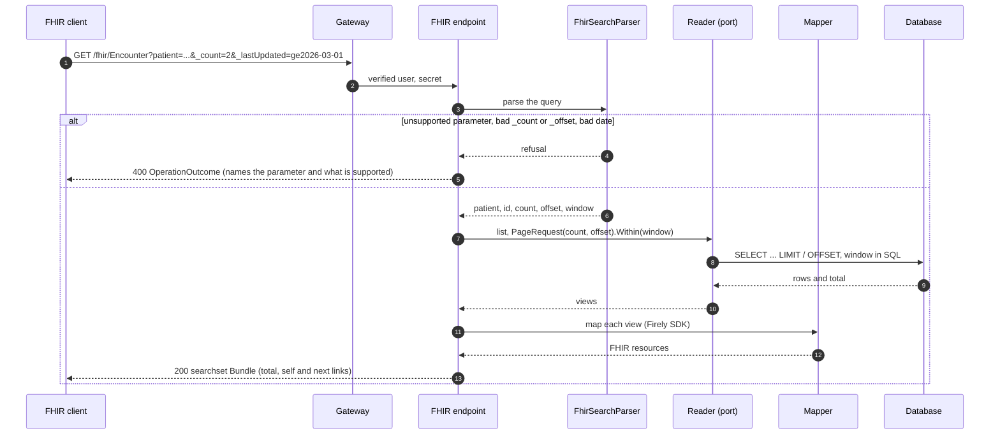
```mermaid
sequenceDiagram
    autonumber
    participant C as FHIR client
    participant G as Gateway
    participant E as FHIR endpoint
    participant P as FhirSearchParser
    participant R as Reader (port)
    participant M as Mapper
    participant D as Database

    C->>G: GET /fhir/Encounter?patient=...&_count=2&_lastUpdated=ge2026-03-01
    G->>E: verified user, secret
    E->>P: parse the query
    alt unsupported parameter, bad _count or _offset, bad date
        P-->>E: refusal
        E-->>C: 400 OperationOutcome (names the parameter and what is supported)
    else
        P-->>E: patient, id, count, offset, window
        E->>R: list, PageRequest(count, offset).Within(window)
        R->>D: SELECT ... LIMIT / OFFSET, window in SQL
        D-->>R: rows and total
        R-->>E: views
        E->>M: map each view (Firely SDK)
        M-->>E: FHIR resources
        E-->>C: 200 searchset Bundle (total, self and next links)
    end
```

Vitals are the exception to "window in SQL": one vitals set becomes up to ten `Observation`s, so that window is applied in memory over a patient's latest 1,000 sets.

---

## 5. State and activity diagrams

### D17. Idempotency claim

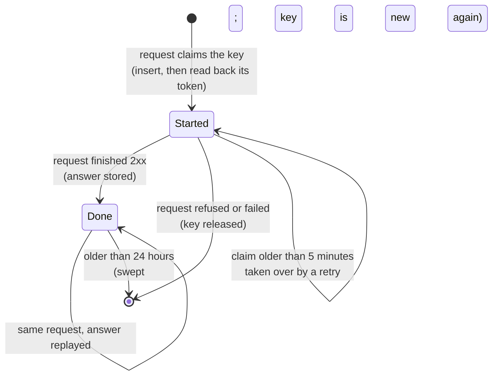
```mermaid
stateDiagram-v2
    [*] --> Started : request claims the key<br/>(insert, then read back its token)
    Started --> Done : request finished 2xx<br/>(answer stored)
    Started --> [*] : request refused or failed<br/>(key released)
    Started --> Started : claim older than 5 minutes<br/>taken over by a retry
    Done --> Done : same request, answer replayed
    Done --> [*] : older than 24 hours<br/>(swept; key is new again)
```

While `Started` and inside the lease, a repeat gets **409**. A repeat of a different request with the same key gets **422** in either state.

### D18. Answering a conditional write

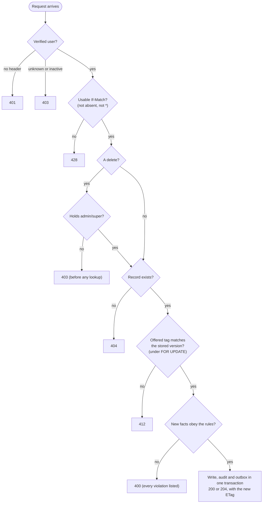
```mermaid
flowchart TD
    A([Request arrives]) --> B{"Verified user?"}
    B -- "no header" --> R401["401"]
    B -- "unknown or inactive" --> R403a["403"]
    B -- yes --> C{"Usable If-Match?<br/>(not absent, not *)"}
    C -- no --> R428["428"]
    C -- yes --> D{"A delete?"}
    D -- yes --> E{"Holds admin/super?"}
    E -- no --> R403["403 (before any lookup)"]
    E -- yes --> F
    D -- no --> F{"Record exists?"}
    F -- no --> R404["404"]
    F -- yes --> G{"Offered tag matches<br/>the stored version?<br/>(under FOR UPDATE)"}
    G -- no --> R412["412"]
    G -- yes --> H{"New facts obey the rules?"}
    H -- no --> R400["400 (every violation listed)"]
    H -- yes --> OK["Write, audit and outbox in one transaction<br/>200 or 204, with the new ETag"]
```

---

## 6. Entity-relationship

### D19. Tables

Legacy tables show only the columns this service touches. Relationships are the joins legacy itself uses; `form_vitals`, `form_soap` and `form_clinical_notes` have **no** encounter column: their link to an encounter is a `forms` row.

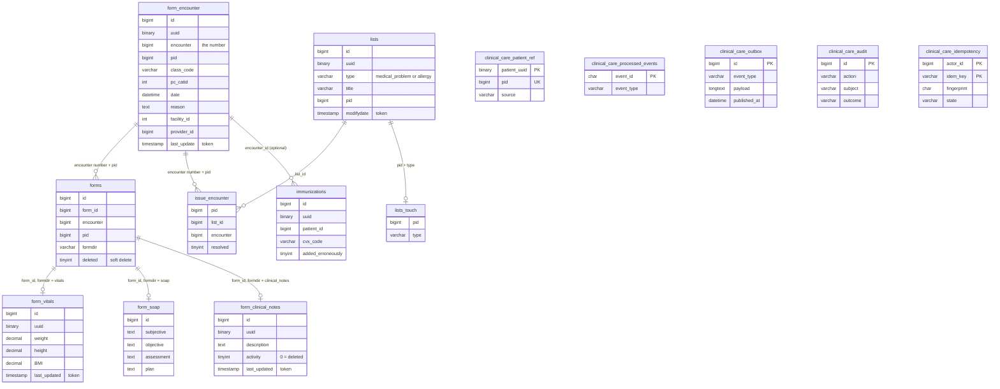
```mermaid
erDiagram
    form_encounter ||--o{ forms : "encounter number + pid"
    forms ||--o| form_vitals : "form_id, formdir = vitals"
    forms ||--o| form_soap : "form_id, formdir = soap"
    forms ||--o| form_clinical_notes : "form_id, formdir = clinical_notes"
    form_encounter ||--o{ issue_encounter : "encounter number + pid"
    lists ||--o{ issue_encounter : "list_id"
    lists ||--o| lists_touch : "pid + type"
    form_encounter ||--o{ immunizations : "encounter_id (optional)"

    form_encounter {
        bigint id
        binary uuid
        bigint encounter "the number"
        bigint pid
        varchar class_code
        int pc_catid
        datetime date
        text reason
        int facility_id
        bigint provider_id
        timestamp last_update "token"
    }
    forms {
        bigint id
        bigint form_id
        bigint encounter
        bigint pid
        varchar formdir
        tinyint deleted "soft delete"
    }
    form_vitals {
        bigint id
        binary uuid
        decimal weight
        decimal height
        decimal BMI
        timestamp last_updated "token"
    }
    form_soap {
        bigint id
        text subjective
        text objective
        text assessment
        text plan
    }
    form_clinical_notes {
        bigint id
        binary uuid
        text description
        tinyint activity "0 = deleted"
        timestamp last_updated "token"
    }
    lists {
        bigint id
        binary uuid
        varchar type "medical_problem or allergy"
        varchar title
        bigint pid
        timestamp modifydate "token"
    }
    issue_encounter {
        bigint pid
        bigint list_id
        bigint encounter
        tinyint resolved
    }
    immunizations {
        bigint id
        binary uuid
        bigint patient_id
        varchar cvx_code
        tinyint added_erroneously
    }
    lists_touch {
        bigint pid
        varchar type
    }

    clinical_care_patient_ref {
        binary patient_uuid PK
        bigint pid UK
        varchar source
    }
    clinical_care_processed_events {
        char event_id PK
        varchar event_type
    }
    clinical_care_outbox {
        bigint id PK
        varchar event_type
        longtext payload
        datetime published_at
    }
    clinical_care_audit {
        bigint id PK
        varchar action
        varchar subject
        varchar outcome
    }
    clinical_care_idempotency {
        bigint actor_id PK
        varchar idem_key PK
        char fingerprint
        varchar state
    }
```

The five `clinical_care_*` tables are this service's own. Everything above them is legacy's, written through column-level grants (doc 06).
