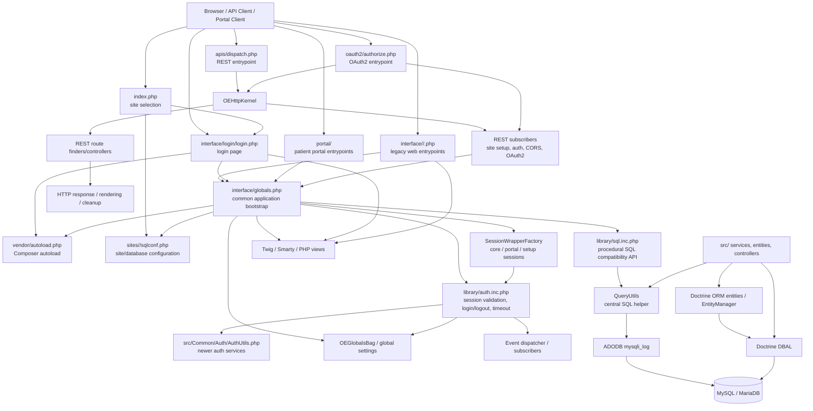

# OpenEMR Architecture Inventory

This document records the architecture findings from the OpenEMR checkout.
File paths are relative to the repository root.

## 1. Top-level folders

| Folder | Responsibility | Evidence |
|---|---|---|
| `src/` | Modern PSR-4 `OpenEMR\` application code: services, entities, controllers, authentication, database abstractions, sessions, FHIR, billing, and other domain code. | [`composer.json`](../composer.json), [`src/`](../src/) |
| `interface/` | Main web UI and legacy PHP request scripts: login, globals/bootstrap, calendar, patient files, forms, billing, administration, and AJAX endpoints. | [`interface/globals.php`](../interface/globals.php), [`interface/login/login.php`](../interface/login/login.php) |
| `library/` | Legacy shared procedural functions, database wrappers, authorization bootstrap, validation, patient/encounter helpers, reporting, and compatibility classes. | [`library/sql.inc.php`](../library/sql.inc.php), [`library/auth.inc.php`](../library/auth.inc.php) |
| `apis/` | REST API dispatch and route definitions. | [`apis/dispatch.php`](../apis/dispatch.php), [`apis/routes/`](../apis/routes/) |
| `oauth2/` | OAuth2 authorization entry points. | [`oauth2/authorize.php`](../oauth2/authorize.php) |
| `portal/` | Patient portal application and portal-specific libraries, pages, sessions, messaging, and reports. | [`portal/app.php`](../portal/app.php), [`portal/patient/`](../portal/patient/) |
| `public/` | Public/static web assets and public web entrypoint. | [`public/index.php`](../public/index.php) |
| `templates/` | Twig, Smarty, and other server-rendered templates. | [`templates/`](../templates/) |
| `controllers/` | Older controller-style PHP classes used by parts of the application. | [`controllers/`](../controllers/) |
| `config/` | Configuration-related PHP and application configuration files. | [`config/`](../config/) |
| `sites/` | Per-site configuration and site-specific data. A valid site has a `sqlconf.php`. | [`index.php`](../index.php), [`sites/`](../sites/) |
| `sql/` | SQL schema, upgrade, and seed assets. | [`sql/`](../sql/) |
| `db/` | Database migration-related PHP and templates. | [`db/`](../db/) |
| `tests/` | Unit, isolated, API, service, acceptance, and end-to-end tests. | [`tests/`](../tests/) |
| `docker/` | Docker images, development/release environments, and container utilities. | [`docker/`](../docker/) |
| `ci/` | Continuous-integration scripts and support files. | [`ci/`](../ci/) |
| `bin/` | Command-line entry points. | [`bin/`](../bin/) |
| `scripts/` | Utility scripts. | [`scripts/`](../scripts/) |
| `contrib/` | Optional utilities and import/export tools. | [`contrib/`](../contrib/) |
| `custom/` | Site/customer-specific customization and export code. | [`custom/`](../custom/) |
| `ccdaservice/` | CCDA/CQM-related service and supporting Node assets. | [`ccdaservice/`](../ccdaservice/) |
| `ccr/` | Continuity of Care Record functionality. | [`ccr/`](../ccr/) |
| `gacl/` | Legacy access-control library and documentation. | [`gacl/`](../gacl/) |
| `swagger/` | API/OpenAPI documentation assets. | [`swagger/`](../swagger/) |
| `webpack/` | Webpack build configuration. | [`webpack/`](../webpack/) |
| `Documentation/` | User, installation, export, and developer documentation. | [`Documentation/`](../Documentation/) |
| `docs/` | Additional documentation; no more specific subdivision was established. | [`docs/`](../docs/) |
| `modules/` | **Not found** as a top-level directory in this checkout. Composer includes external OpenEMR module packages. | [`composer.json`](../composer.json) |

`vendor/` and `node_modules/` are dependency/build directories, not application
architecture layers.

## 2. Request flow

OpenEMR has multiple request families rather than one universal front controller.

### Normal browser request

Typical legacy UI requests enter through a PHP file under `interface/`. These
files commonly include `interface/globals.php`; for example, the patient payment
page does so before executing its feature logic.

```text
Browser
  |
  v
interface/<feature>/<entrypoint>.php
  |
  +--> interface/globals.php
  |      |
  |      +--> vendor/autoload.php
  |      +--> environment, logger, error handler
  |      +--> request/session/site setup
  |      +--> library/sql.inc.php
  |      +--> global settings
  |      +--> library/auth.inc.php unless auth is ignored
  |
  +--> feature-specific procedural code
  +--> sqlStatement/sqlQuery/sqlFetchArray
  +--> HTML/Twig/Smarty response
```

Evidence:

- [`interface/patient_file/front_payment.php`](../interface/patient_file/front_payment.php)
- [`interface/globals.php`](../interface/globals.php)

### Site-selection request

The root [`index.php`](../index.php) finds site directories containing
`sqlconf.php`, selects the site from `site`, the host, or `default`, includes the
site configuration, and redirects to either login or setup.

### Login

[`interface/login/login.php`](../interface/login/login.php):

1. Loads Composer autoloading.
2. Selects the core application session cookie.
3. Sets `$ignoreAuth = true`.
4. Includes [`interface/globals.php`](../interface/globals.php).
5. Uses session and application services to prepare the login view.
6. Queries application and language configuration using `sqlStatement`.
7. Renders through a template event/Twig layout.

### Authentication and authorization

For authenticated requests, `globals.php` includes
[`library/auth.inc.php`](../library/auth.inc.php) unless authentication is
explicitly ignored. The authorization bootstrap:

- Detects normal and Google login submissions.
- Calls `AuthUtils::confirmPassword()` for normal login.
- Calls `AuthUtils::verifyGoogleSignIn()` for Google login.
- Calls `AuthUtils::authCheckSession()` for existing sessions.
- Enforces session expiration through `SessionTracker`.
- Destroys the core session and redirects on logout or failed authentication.

Evidence:

- [`interface/globals.php`](../interface/globals.php)
- [`library/auth.inc.php`](../library/auth.inc.php)
- [`src/Common/Auth/AuthUtils.php`](../src/Common/Auth/AuthUtils.php)
- [`src/Common/Session/SessionTracker.php`](../src/Common/Session/SessionTracker.php)

### Session bootstrap

[`SessionWrapperFactory`](../src/Common/Session/SessionWrapperFactory.php)
selects the active core or portal session according to the application cookie.
`globals.php` configures read-only versus writable behavior, obtains the active
session, and stores the site ID in it.

Native PHP session startup remains underneath the abstraction:

- [`src/Common/Session/SessionWrapperFactory.php`](../src/Common/Session/SessionWrapperFactory.php)
- [`src/Common/Session/Storage/ReadAndCloseNativeSessionStorage.php`](../src/Common/Session/Storage/ReadAndCloseNativeSessionStorage.php)
- [`interface/globals.php`](../interface/globals.php)

### REST/API request

REST requests enter through [`apis/dispatch.php`](../apis/dispatch.php).
[`ApiApplication`](../src/RestControllers/ApiApplication.php) constructs an
`OEHttpKernel`, controller resolver, argument resolver, request stack, event
dispatcher, and API subscribers.

The `SiteSetupListener` still includes the legacy
[`interface/globals.php`](../interface/globals.php), so the modern REST layer
reuses the legacy global/database bootstrap.

Relevant files:

- [`apis/dispatch.php`](../apis/dispatch.php)
- [`src/RestControllers/ApiApplication.php`](../src/RestControllers/ApiApplication.php)
- [`src/RestControllers/Subscriber/SiteSetupListener.php`](../src/RestControllers/Subscriber/SiteSetupListener.php)
- [`src/RestControllers/Subscriber/AuthorizationListener.php`](../src/RestControllers/Subscriber/AuthorizationListener.php)
- [`src/RestControllers/Subscriber/RoutesExtensionListener.php`](../src/RestControllers/Subscriber/RoutesExtensionListener.php)

### OAuth2

OAuth2 authorization begins at [`oauth2/authorize.php`](../oauth2/authorize.php)
and uses the newer routing infrastructure. The complete end-to-end OAuth2
sequence was not traced beyond that entry point in this inventory.

## 3. Database access

### Legacy database bootstrap

[`library/sql.inc.php`](../library/sql.inc.php):

1. Includes site/database configuration through `sqlconf.php`.
2. Builds `DatabaseConnectionOptions`.
3. Creates an ADODB `mysqli_log` connection through
   `DatabaseConnectionFactory::createAdodb()`.
4. Stores it in `$GLOBALS['adodb']['db']` and `$GLOBALS['dbh']`.
5. Sets associative-fetch mode.

Evidence:

- [`library/sql.inc.php`](../library/sql.inc.php)
- [`src/BC/DatabaseConnectionFactory.php`](../src/BC/DatabaseConnectionFactory.php)
- [`src/BC/DatabaseConnectionOptions.php`](../src/BC/DatabaseConnectionOptions.php)

### `sqlStatement()` and `sqlQuery()`

The procedural SQL functions remain the compatibility API:

- `sqlStatement()` delegates to `QueryUtils::sqlStatementThrowException()`,
  logs errors, and uses `HelpfulDie()` on failure.
- `sqlStatementThrowException()` delegates while preserving exceptions.
- `sqlStatementNoLog()` explicitly bypasses SQL auditing.
- `sqlFetchArray()` delegates result extraction to `QueryUtils`.
- `sqlQuery()` is also defined in the same compatibility file.

Evidence:

- [`library/sql.inc.php`](../library/sql.inc.php)
- [`interface/patient_file/front_payment.php`](../interface/patient_file/front_payment.php)

### `QueryUtils`

[`QueryUtils`](../src/Common/Database/QueryUtils.php) centralizes SQL
execution and result handling for both legacy wrappers and newer code. Its
execution method:

1. Converts empty bind arrays to the legacy `false` representation.
2. Calls ADODB `Execute()` for audited statements or `ExecuteNoLog()` for
   explicitly unaudited statements.
3. Throws `SqlQueryException` on failure.
4. Returns the ADODB recordset.

It also provides record fetching, insert helpers, schema metadata, identifier
escaping, and schema caches.

### Doctrine DBAL and ORM

Doctrine DBAL and ORM are dependencies, but they do not replace the existing
ADODB compatibility path everywhere.

- [`DatabaseConnectionFactory::createDbal()`](../src/BC/DatabaseConnectionFactory.php)
  creates a DBAL connection through `DriverManager`.
- [`src/BC/Database.php`](../src/BC/Database.php) wraps DBAL for compatibility
  and explicitly says new code should continue using existing wrappers such as
  `QueryUtils`.
- [`ConnectionManager`](../src/Common/Database/ConnectionManager.php) provides
  named, lazily-created DBAL connections.
- Doctrine ORM entities exist under [`src/Entities/`](../src/Entities/).
- Some services inject `EntityManagerInterface`, including
  [`CodeTypeMappingUpdater`](../src/Services/CodeTypes/CodeTypeMappingUpdater.php).

Current database shape:

```text
Legacy UI / services
  |
  v
sqlStatement/sqlQuery
  |
  v
QueryUtils
  |
  v
ADODB mysqli_log
  |
  v
MySQL / MariaDB

Selected newer services
  |
  +--> Doctrine DBAL Connection
  |
  +--> Doctrine ORM EntityManager
```

PDO is a required PHP extension, but a complete application-wide PDO request
path was **not found** in this inventory.

## 4. Legacy and modern code split

### Legacy areas

The main browser application remains heavily procedural:

- UI files include `interface/globals.php` directly.
- `globals.php` loads `library/sql.inc.php`.
- Authentication is conditionally loaded from `library/auth.inc.php`.
- Feature pages directly call `sqlStatement()` and access session/global state.
- Database connections remain exposed through `$GLOBALS['adodb']['db']` and
  `$GLOBALS['dbh']`.

### Modernized areas

The following areas have substantial object-oriented infrastructure:

- Authentication and MFA: [`src/Common/Auth/`](../src/Common/Auth/)
- Sessions: [`src/Common/Session/`](../src/Common/Session/)
- REST kernel/controllers/subscribers: [`src/RestControllers/`](../src/RestControllers/)
- Services: [`src/Services/`](../src/Services/)
- Domain entities: [`src/Entities/`](../src/Entities/)
- Database connection management and selected DBAL/ORM paths:
  [`src/Common/Database/`](../src/Common/Database/) and [`src/BC/`](../src/BC/)
- Template-oriented login rendering:
  [`interface/login/login.php`](../interface/login/login.php)

### Estimate

The checkout contains approximately:

- 2,104 PHP files under `src/`
- 1,049 PHP files under `interface/`
- 525 PHP files under `library/`

These are file counts, not lines of code or executed-path coverage. `src/`
contains substantial modern OO code, but the main browser runtime remains
legacy-dominated because its entrypoints still use the
`globals.php`/`sql.inc.php`/`auth.inc.php` chain.

The migration is therefore hybrid and transitional, not complete. The strongest
evidence is that the modern REST setup still includes
`interface/globals.php`, while the DBAL compatibility layer directs callers
toward existing wrappers.

## 5. Mermaid layer flowchart


