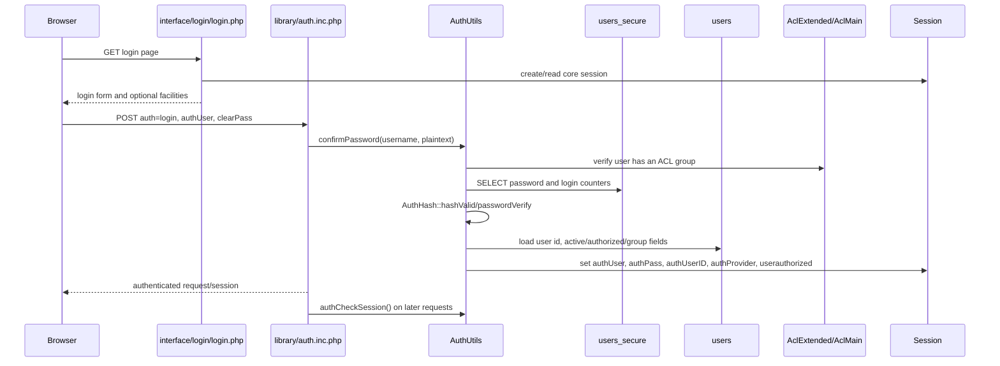
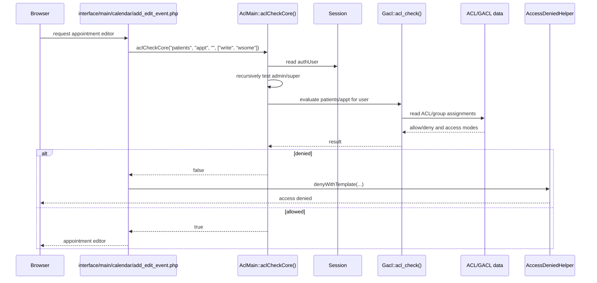

# Permissions and authentication

This report describes the authorization and login mechanisms found in this
checkout. OpenEMR has a legacy-compatible GACL layer exposed through
`AclMain`, procedural compatibility code, and newer services that still
delegate to the same authorization model.

## Authorization architecture

[`AclMain::aclCheckCore()`](../src/Common/Acl/AclMain.php) is the main
application-facing permission check. It accepts an ACO section, an ACO value,
an optional username, and an optional access mode. The documented access modes
are:

- `view`: view but not add or modify
- `write`: add or modify
- `wsome`: limited add/modify access
- `addonly`: view and add, but not modify

If no user is supplied, `AclMain` reads `authUser` from the active session. A
user with `admin/super` access is granted access to other ACOs by the recursive
superuser check in
[`AclMain::aclCheckCore()`](../src/Common/Acl/AclMain.php:170). The underlying
GACL implementation is [`Gacl::acl_check()`](../src/Gacl/Gacl.php:183).

`AclMain` also provides:

- [`aclCheckAcoSpec()`](../src/Common/Acl/AclMain.php), for checking a compound
  ACO specification.
- [`aclCheckForm()`](../src/Common/Acl/AclMain.php), for form permissions.
- [`aclCheckIssue()`](../src/Common/Acl/AclMain.php), for issue-type
  permissions.

## ACO sections and values used most

The supported sections and their documented values are listed in the class
header of [`AclMain.php`](../src/Common/Acl/AclMain.php). The most frequently
encountered application checks in the inspected pages and services are:

| ACO section/value | Common access modes | Representative callers |
|---|---|---|
| `admin/super` | usually default boolean check | Administrative pages and privileged branches such as [`usergroup_admin.php`](../interface/usergroup/usergroup_admin.php) and drug/code-management pages |
| `admin/users` | default, sometimes `write` | User, group, facility-user, and log administration: [`user_admin.php`](../interface/usergroup/user_admin.php), [`usergroup_admin.php`](../interface/usergroup/usergroup_admin.php), [`facility_admin.php`](../interface/usergroup/facility_admin.php), [`logview.php`](../interface/logview/logview.php) |
| `admin/practice` | default | Practice/NPI administration: [`npi_lookup.php`](../interface/usergroup/npi_lookup.php) |
| `patients/appt` | `view`, `write`, `wsome` | Calendar and appointment editing: [`add_edit_event.php`](../interface/main/calendar/add_edit_event.php), appointment controllers/services |
| `patients/demo` | `write`, `addonly` | Patient creation and demographic editing: [`new_patient_save.php`](../interface/new/new_patient_save.php), patient pages |
| `patients/med` | `write`, `addonly` | Clinical-rule and medication-related authorization: [`clinical_rules.php`](../library/clinical_rules.php) |
| `patients/docs` | `view`, `write`, `addonly` | Document access/upload: [`documents.php`](../library/documents.php), [`upload.php`](../library/ajax/upload.php) |
| `patients/rx` | `write`, `addonly` | Prescription pages and REST routes |
| `patients/lab` and `patients/sign` | `write`, `addonly` | Lab result and signing workflows |
| `acct/bill` | default or `write` | Billing and fee-sheet code, including [`FeeSheet.class.php`](../library/FeeSheet.class.php) |
| `acct/disc` | default | Discount authorization in [`FeeSheet.class.php`](../library/FeeSheet.class.php) |
| `encounters/auth` and `encounters/auth_a` | default/write variants | Encounter authorization for the current provider versus any provider |
| `encounters/coding` and `encounters/coding_a` | `write`, `wsome` | Encounter coding workflows |
| `groups/gcalendar` | `view`, `write` | Group-calendar access in [`add_edit_event.php`](../interface/main/calendar/add_edit_event.php) |
| `inventory/*` | section-specific | Inventory pages such as [`add_edit_lot.php`](../interface/drugs/add_edit_lot.php) and [`drug_inventory.php`](../interface/drugs/drug_inventory.php) |

The repository contains many additional checks. The table identifies the
recurring sections/values and representative callers rather than claiming that
these are the only ACOs used.

## Where checks are enforced

### Page entrypoints

Legacy pages commonly deny access immediately after loading globals. Examples:

- [`interface/main/calendar/add_edit_event.php`](../interface/main/calendar/add_edit_event.php)
  checks `patients/appt` with `write` or `wsome`.
- [`interface/usergroup/user_admin.php`](../interface/usergroup/user_admin.php)
  checks `admin/users`.
- [`interface/usergroup/usergroup_admin.php`](../interface/usergroup/usergroup_admin.php)
  checks both `admin/users` and `admin/super`.
- [`interface/drugs/dispense_drug.php`](../interface/drugs/dispense_drug.php)
  checks `admin/drugs`.
- [`interface/code_systems/list_installed.php`](../interface/code_systems/list_installed.php)
  checks `admin/super`.
- [`library/ajax/upload.php`](../library/ajax/upload.php) chooses document
  `view` versus `write`/`addonly` checks based on the upload operation.

The calendar example uses
[`AccessDeniedHelper::denyWithTemplate()`](../src/Common/Acl/AccessDeniedHelper.php)
after a failed `AclMain::aclCheckCore()` result.

### Services and non-page code

Authorization is also called from service/domain support code, not only from
HTML pages:

- [`library/clinical_rules.php`](../library/clinical_rules.php) checks an
  access-control specification and separately checks `patients/med`.
- [`library/FeeSheet.class.php`](../library/FeeSheet.class.php) checks
  `acct/disc` or `acct/bill` before discount-related behavior.
- [`library/dicom_frame.php`](../library/dicom_frame.php) checks
  `patients/docs`.
- [`AclExtended.php`](../src/Common/Acl/AclExtended.php) uses
  `AclMain::aclCheckCore()` while editing ACL/group structures.
- REST route/controller-specific ACL enforcement is represented by the
  prescription and FHIR route tests under
  [`tests/Tests/Isolated/RestRoutes/`](../tests/Tests/Isolated/RestRoutes/).

The existence of a menu item or route is not itself the authorization boundary;
the page/controller or the underlying operation must perform the check.

## Logged-in user and facility in the session

After successful authentication,
[`AuthUtils::setUserSessionVariables()`](../src/Common/Auth/AuthUtils.php:2019)
stores:

| Session key | Meaning |
|---|---|
| `authUser` | Authenticated username |
| `authPass` | Stored password hash used to validate the session later |
| `authUserID` | Authenticated user ID |
| `authProvider` | Resolved authorization/group identity |
| `userauthorized` | Provider/authorization flag, adjusted when `see_auth` is greater than `2` |

[`AclMain::aclCheckCore()`](../src/Common/Acl/AclMain.php:170) reads
`authUser` when the caller does not explicitly name a user.
[`AuthUtils::authCheckSession()`](../src/Common/Auth/AuthUtils.php) validates
that the session remains valid; `auth.inc.php` invokes it for already logged-in
requests and closes the session if it fails.

Facility context has two related session values:

1. [`main_screen.php`](../interface/main/main_screen.php:407) stores the
   selected/default facility in `facilityId` and may persist it in the
   `pc_facility` cookie.
2. [`calendar/index.php`](../interface/main/calendar/index.php:50) derives the
   calendar facility filter from `facilityId`, the cookie, a submitted/query
   facility, or the user's available facilities, then stores the result as
   `pc_facility`.

Calendar pages read `pc_facility` to restrict event queries, while general
patient/service code can read `facilityId`; these are not interchangeable
permission grants. Facility visibility is additionally filtered by
[`getUserFacilities()`](../library/calendar.inc.php), which reads user/facility
assignment data.

## Login flow

The normal browser login starts in
[`interface/login/login.php`](../interface/login/login.php), which renders the
login form and facility/language choices. The login submission is processed by
[`library/auth.inc.php`](../library/auth.inc.php):

1. It verifies that the request has the expected `auth=login`,
   `new_login_session_management`, username, and password fields.
2. It sets language session values.
3. It calls `AuthUtils::confirmPassword()` for normal login, or the Google
   sign-in verifier for the configured Google path.
4. On failure it records `loginfailure`, clears the password from memory where
   possible, and returns to the login screen.
5. On success, `AuthUtils` resolves the user/group, verifies the account is
   configured and belongs to an ACL group, and calls
   `setUserSessionVariables()`.
6. Subsequent requests run `AuthUtils::authCheckSession()` and session-expiry
   handling in [`auth.inc.php`](../library/auth.inc.php).

`AuthUtils` also checks login-failure counters, IP throttling/blocking, account
activity, and ACL-group membership. LDAP/Active Directory and Google
authentication are supported branches; the normal local-password branch is
described below.

## Password hashing

[`AuthHash.php`](../src/Common/Auth/AuthHash.php) selects the configured
algorithm from OpenEMR globals:

- bcrypt
- Argon2i
- Argon2id
- PHP `PASSWORD_DEFAULT`
- legacy/configurable SHA-512 `crypt` mode

`passwordHash()` uses PHP `password_hash()` for the standard algorithms and
`crypt()` for SHA-512 mode. `passwordVerify()` wraps PHP
`password_verify()` for standard hashes and handles the legacy SHA-512 form.
The configured algorithm/options and rehash decision are handled by
[`AuthHash::passwordNeedsRehash()`](../src/Common/Auth/AuthHash.php).

For local login, [`AuthUtils::confirmUserPassword()`](../src/Common/Auth/AuthUtils.php)
loads the password from `users_secure`, validates the stored hash, and verifies
the supplied password. It also uses a dummy hash path to reduce username
enumeration timing differences. Successful authentication stores the existing
hash in the session; the plaintext password is cleared from memory after
authentication paths complete.

## Login sequence diagram

## Permission-check sequence diagram

## What an independent authentication service would need to replicate

An independent service could replace the login boundary only if it preserves
the application contract, not merely username/password verification. It would
need to provide:

1. **A stable principal:** username, numeric user ID, active status, provider
   or authorization group, and the `authorized`/`see_auth` behavior used to
   populate `userauthorized`.
2. **ACL-group compatibility:** membership in the groups consumed by
   `AclMain`/GACL and a way to evaluate every required section/value pair,
   including access modes `view`, `write`, `wsome`, and `addonly`.
3. **Session claims:** values equivalent to `authUser`, `authUserID`,
   `authProvider`, `userauthorized`, and the session-integrity material
   represented by `authPass`, or a carefully integrated replacement for
   `authCheckSession()`.
4. **Facility context:** the selected/default facility, available facility
   assignments, and the calendar-specific `pc_facility` filtering behavior.
   Facility selection must not be treated as unrestricted access; the server
   must still enforce user/facility assignments.
5. **Password migration:** verification for the configured bcrypt/Argon2/PHP
   hashes and legacy SHA-512 `crypt` hashes, plus rehash-on-login behavior.
   The service must keep password hashes in the `users_secure` contract or
   provide an explicit migration mechanism.
6. **Abuse controls:** failed-login counters, IP throttling/blocking, account
   activity checks, timing-attack mitigation, MFA integration where enabled,
   logout/session-expiry behavior, and audit events.
7. **Non-password providers:** the configured LDAP/Active Directory and Google
   sign-in branches if those deployments are in scope.
8. **Authorization at each operation:** route/page authentication alone is not
   enough; existing pages and services perform operation-specific ACO checks.
   The replacement must preserve those checks or provide a compatible
   authorization adapter.

## Explicit limits

- The repository contains many individual `AclMain::aclCheckCore()` call sites;
  this document lists the documented ACO catalog and representative recurring
  calls, not every call site.
- `Gacl` stores/evaluates the ACL model, but the complete database schema and
  every administrative mutation path were not reproduced here.
- Facility selection is split between general `facilityId`, calendar
  `pc_facility`, and the `pc_facility` cookie. No single universal
  `current_facility` session key was found.
- OAuth2, portal authentication, MFA challenge handling, and LDAP have
  additional paths in [`src/Common/Auth/`](../src/Common/Auth/); this report
  focuses on the core browser login and application ACL contract.
