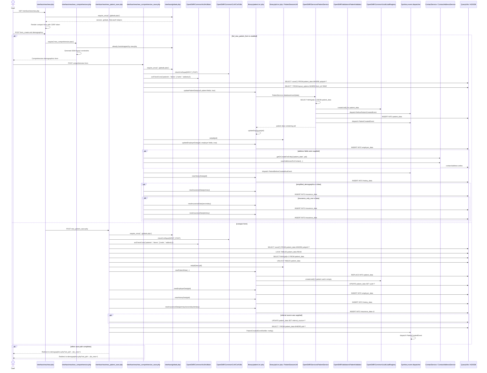

# End-to-end trace: register a new patient

This trace covers both registration branches implemented by the UI:

- The default compact form posts to `new_patient_save.php`.
- When the `full_new_patient_form` global is enabled, `new.php` includes
  `new_comprehensive.php`, which posts to `new_comprehensive_save.php`.

The compact and comprehensive paths do not have identical behavior. This
document follows both and does not infer behavior that is not visible in the
source.

## 1. Sequence diagram



## 2. UI entry and branch selection

The compact registration page is
[`interface/new/new.php`](../interface/new/new.php). It:

- Includes [`interface/globals.php`](../interface/globals.php).
- Checks `full_new_patient_form`.
- Includes [`new_comprehensive.php`](../interface/new/new_comprehensive.php)
  instead of rendering the compact form when that global is enabled.
- Otherwise renders a POST form targeting
  [`interface/new/new_patient_save.php`](../interface/new/new_patient_save.php).
- Includes a CSRF token generated by `CsrfUtils::collectCsrfToken()`.
- Performs browser-side checks for configured referral source, sex, and DOB
  requirements, then submits.

Relevant functions/locations:

- `new.php`: branch selection and `validate()`,
  [`interface/new/new.php`](../interface/new/new.php)
- `new_comprehensive.php`: `LBF_Validation::generate_validate_constraints("DEM")`
  and JavaScript `submitme(...)`,
  [`interface/new/new_comprehensive.php`](../interface/new/new_comprehensive.php)
- `LBF_Validation::generate_validate_constraints()`,
  [`library/validation/LBF_Validation.php`](../library/validation/LBF_Validation.php)
- `submitme()`,
  [`library/validation/validation_script.js.php`](../library/validation/validation_script.js.php)

## 3. Business rules found

### Rules common to both save endpoints

| Rule | File and function | Observed behavior |
|---|---|---|
| CSRF protection | `CsrfUtils::checkCsrfInput()` in [`interface/new/new_patient_save.php`](../interface/new/new_patient_save.php) and [`interface/new/new_comprehensive_save.php`](../interface/new/new_comprehensive_save.php) | The POST must contain a valid CSRF token; the call uses `dieOnFail: true`. |
| Patient-create ACL | `AclMain::aclCheckCore()` in both save files | Requires `patients`, `demo`, and either `write` or `addonly`. Failure is passed to `AccessDeniedHelper::denyWithTemplate()`. |
| External/public patient ID check | Save endpoint code in both files | If `pubpid`/`form_pubpid` is non-empty, the endpoint counts matching `patient_data.pubpid` values. The compact path reloads `new.php` and exits on a duplicate. The comprehensive path sets a warning alert but continues. |
| Patient session selection | `setpid()` in [`library/pid.inc.php`](../library/pid.inc.php) | Stores the new PID through `PatientSessionUtil::setPid()`. |
| Redirect after save | Bottom of both save files | Redirects to `patient_file/summary/demographics.php` with `set_pid` and `is_new=1`. |

### Compact form rules

| Rule | File and function | Observed behavior |
|---|---|---|
| PID generation | Top-level save logic in [`interface/new/new_patient_save.php`](../interface/new/new_patient_save.php) | Locks `patient_data` for read, selects `MAX(pid)+1`, unlocks, defaults to `1` if the result is not greater than `1`, then calls `setpid()`. The source itself notes that unlocking occurs before the insert. |
| Public PID default | Top-level save logic in [`interface/new/new_patient_save.php`](../interface/new/new_patient_save.php) | Uses submitted `pubpid` when non-empty; otherwise uses the generated PID. |
| Name normalization | Top-level save logic in [`interface/new/new_patient_save.php`](../interface/new/new_patient_save.php) | Applies `ucwords(trim(...))` to first, middle, and last names. |
| Date normalization | Top-level save logic in [`interface/new/new_patient_save.php`](../interface/new/new_patient_save.php) | Converts DOB and registration date with `DateToYYYYMMDD()`. |
| Empty defaults | Call to `newPatientData()` in [`interface/new/new_patient_save.php`](../interface/new/new_patient_save.php) | The compact path passes empty strings for address, contact, email, language, financial, provider, HIPAA, and related fields; sex, DOB, registration date, names, title, PID, and public PID are supplied. |
| Price level default | `newPatientData()` in [`library/patient.inc.php`](../library/patient.inc.php) | Selects the active `pricelevel` option with default/sequence ordering; uses an empty string when no option is found. |
| Existing-row guard | `newPatientData()` in [`library/patient.inc.php`](../library/patient.inc.php) | If a PID is supplied, reads the existing row and verifies that the supplied database `id` matches the row’s `id`; mismatch terminates with an internal error. |
| UUID fallback | `newPatientData()` in [`library/patient.inc.php`](../library/patient.inc.php) | After the `REPLACE`, rereads the row and creates/updates a UUID when the row has no UUID. |

The compact endpoint does **not** call `PatientValidator::validate()` or
`PatientService::insert()`. Its direct call is
`newPatientData()` in [`library/patient.inc.php`](../library/patient.inc.php).

### Comprehensive form rules

| Rule | File and function | Observed behavior |
|---|---|---|
| Client-side DEM constraints | `new_comprehensive.php` and `LBF_Validation::generate_validate_constraints()` | Constraints are generated from the `DEM` layout and passed to JavaScript `submitme()`. These are browser-side checks. |
| Layout-driven field selection | Top-level save logic in [`interface/new/new_comprehensive_save.php`](../interface/new/new_comprehensive_save.php) | Reads active `layout_options` rows for `form_id='DEM'`, accepts fields with `uor > 0` or `pubpid`, maps `em_` fields to `employer_data`, and only reads submitted fields. |
| Patient-service insert defaults | `PatientService::databaseInsert()` in [`src/Services/PatientService.php`](../src/Services/PatientService.php) | Generates PID, UUID, current `date` and `regdate`, `created_by`, `updated_by`, and defaults `pubpid` to PID when empty. |
| Service event mutation point | `PatientService::databaseInsert()` | Dispatches `BeforePatientCreatedEvent`; listeners can modify the patient data before the INSERT. |
| Comprehensive duplicate behavior | Top-level save logic in [`interface/new/new_comprehensive_save.php`](../interface/new/new_comprehensive_save.php) | Duplicate `pubpid` produces an alert string but does not stop the insert. |
| Simplified insurance behavior | Top-level save logic in [`interface/new/new_comprehensive_save.php`](../interface/new/new_comprehensive_save.php) | Always creates history; skips insurance when `simplified_demographics` is true. |
| One-insurance behavior | Top-level save logic in [`interface/new/new_comprehensive_save.php`](../interface/new/new_comprehensive_save.php) | When `insurance_only_one` is true, only primary insurance is inserted; otherwise secondary and tertiary are also attempted. |
| Optional address persistence | Top-level save logic in [`interface/new/new_comprehensive_save.php`](../interface/new/new_comprehensive_save.php) | Address layout fields are saved through `ContactService` and `ContactAddressService`; failures are caught and logged. |

Although [`PatientValidator`](../src/Validators/PatientValidator.php) defines
database-insert rules—required first name, last name, sex, DOB, and conditional
email validation—`new_comprehensive_save.php` calls
`updatePatientData(..., true)`, which calls `PatientService::databaseInsert()`
directly. It does not call `PatientService::insert()`, the method that invokes
`PatientValidator::validate()`. Therefore these validator rules are defined in
the codebase but are not on this traced comprehensive form's server-side call
path.

## 4. Database writes and side effects

### Patient row

#### Compact path

`new_patient_save.php` calls `newPatientData()` in
[`library/patient.inc.php`](../library/patient.inc.php):

```text
new_patient_save.php
  -> newPatientData()
  -> QueryUtils::sqlInsert()
  -> REPLACE INTO patient_data SET ...
```

The `patient_data` write includes the supplied demographics and defaults such
as `fitness`, `referral_source`, `regdate`, `pricelevel`, and `date = NOW()`.
The source SQL is in `newPatientData()`.

#### Comprehensive path

`new_comprehensive_save.php` calls `updatePatientData(null, $newdata, true)`.
That wrapper calls `PatientService::databaseInsert()`, which:

1. Selects `MAX(pid)+1`.
2. Creates a `patient_data` UUID.
3. Adds current timestamps and authenticated user IDs.
4. Applies `BeforePatientCreatedEvent` listeners.
5. Inserts into `patient_data`.
6. Dispatches `PatientCreatedEvent`.

Evidence:

- [`library/patient.inc.php`](../library/patient.inc.php)
- [`src/Services/PatientService.php`](../src/Services/PatientService.php)
- [`src/Events/Patient/BeforePatientCreatedEvent.php`](../src/Events/Patient/BeforePatientCreatedEvent.php)
- [`src/Events/Patient/PatientCreatedEvent.php`](../src/Events/Patient/PatientCreatedEvent.php)

### Employer data

Both paths call `newEmployerData($pid)` or the comprehensive
`updateEmployerData($pid, ..., true)`:

- Compact: `newEmployerData()` inserts a mostly empty row into `employer_data`.
  [`library/patient.inc.php`](../library/patient.inc.php)
- Comprehensive: `EmployerService::updateEmployerData()` handles the layout
  fields and inserts into `employer_data`.
  [`src/Services/EmployerService.php`](../src/Services/EmployerService.php)

### History data

Both paths call `newHistoryData($pid)`, which constructs
`SocialHistoryService` and calls `create()`. The service inserts into
`history_data`, adds `created_by`, creates a UUID, and fires pre/post save
service events.

Evidence:

- `newHistoryData()` in [`library/patient.inc.php`](../library/patient.inc.php)
- `SocialHistoryService::create()` and its insert implementation in
  [`src/Services/SocialHistoryService.php`](../src/Services/SocialHistoryService.php)

### Insurance data

`newInsuranceData()` inserts into `insurance_data` with the requested type and
the supplied subscriber/policy fields. The compact path calls it for primary,
secondary, and tertiary with empty values. The comprehensive path populates
those values from POST data, subject to `simplified_demographics` and
`insurance_only_one`.

Evidence:

- `newInsuranceData()` in [`library/patient.inc.php`](../library/patient.inc.php)
- Calls in [`interface/new/new_patient_save.php`](../interface/new/new_patient_save.php)
- Calls in [`interface/new/new_comprehensive_save.php`](../interface/new/new_comprehensive_save.php)

### Contact/address data

The comprehensive path may create or retrieve a contact for the patient and
save address rows through `ContactAddressService`. The exact physical table
names written by those services were not followed to completion in this
trace.

Evidence:

- [`interface/new/new_comprehensive_save.php`](../interface/new/new_comprehensive_save.php)
- [`src/Services/ContactService.php`](../src/Services/ContactService.php)
- [`src/Services/ContactAddressService.php`](../src/Services/ContactAddressService.php)

### UUID mapping and event subscribers

`PatientService::databaseInsert()` dispatches `PatientCreatedEvent`.
The FHIR UUID mapping subscriber listens for that event:

- [`src/Services/FHIR/Subscriber/UuidMappingEventsSubscriber.php`](../src/Services/FHIR/Subscriber/UuidMappingEventsSubscriber.php)

The compact path uses
[`PatientCreatedEventNotifier`](../src/Events/Patient/PatientCreatedEventNotifier.php)
after rereading `patient_data`, because the legacy `newPatientData()` path
bypasses `PatientService::databaseInsert()`.

The custom Weno module listens to the comprehensive auxiliary event:

- [`interface/modules/custom_modules/oe-module-weno/src/Bootstrap.php`](../interface/modules/custom_modules/oe-module-weno/src/Bootstrap.php)
- `persistPatientWenoPharmacies()` in that module's bootstrap

The Comlink telehealth module also listens for `PatientCreatedEvent`:

- [`interface/modules/custom_modules/oe-module-comlink-telehealth/src/Controller/TeleHealthVideoRegistrationController.php`](../interface/modules/custom_modules/oe-module-comlink-telehealth/src/Controller/TeleHealthVideoRegistrationController.php)

These module listeners are event-driven side effects; their downstream writes
were not followed in this trace.

### Audit logs and notifications

No direct `EventAuditLogger` write, email send, SMS send, or notification insert
was found in either new-patient save endpoint, `newPatientData()`,
`PatientService::databaseInsert()`, `newEmployerData()`, `newHistoryData()`, or
`newInsuranceData()`.

The event subscribers above may perform additional module-specific work. A
general patient-creation audit or notification side effect was **not found** in
the traced core path.

## 5. Validation, duplicate checks, and ACL summary

| Concern | Compact path | Comprehensive path |
|---|---|---|
| CSRF | Required by `CsrfUtils::checkCsrfInput()` | Required by `CsrfUtils::checkCsrfInput()` |
| ACL | `patients/demo` with `write` or `addonly` | `patients/demo` with `write` or `addonly` |
| Browser validation | Basic referral/sex/DOB checks in `new.php` | Layout-generated DEM constraints through `submitme()` |
| Server-side `PatientValidator` | Not called | Not called by this form path |
| Duplicate `pubpid` | Stops and reloads the form | Warns but continues |
| Duplicate person matching | Not found in this path | Not found in this path |
| PID allocation | `LOCK TABLES ... READ`, then `MAX(pid)+1`, then unlock | `MAX(pid)+1` inside `PatientService::getFreshPid()` |
| UUID | Created after legacy insert if missing | Created before insert by `PatientService` |
| Session PID | `setpid()` before insert | `setpid()` after patient insert |

## 6. Trace termination and uncertainty

The following points could not be followed completely from the inspected
registration path:

1. **Contact table writes:** the comprehensive address branch ends at
   `ContactService::getOrCreateForEntity()` and
   `ContactAddressService::saveAddressesForContact()`. Their lower-level SQL
   and exact tables were not traced here.
2. **Event subscriber side effects:** the core dispatch points are identified,
   but module listeners such as Weno and Comlink may perform additional writes.
   Their downstream operations were not followed.
3. **`PatientCreatedEvent` subscriber registration:** the FHIR UUID mapping
   subscriber is identified, but the complete module/event wiring and every
   listener's database effects were not enumerated.
4. **Database transaction boundary:** no transaction surrounding the complete
   patient-plus-employer-plus-history-plus-insurance sequence was found in the
   save endpoints or the directly traced helper methods.
5. **Failure/rollback behavior:** the endpoints do not show a compensating
   rollback for a later employer, history, insurance, contact, or event failure.
   The comprehensive address branch catches and logs `Throwable`; the rest of
   the exact failure behavior is delegated to the called database/service code.
6. **Patient search/duplicate matching:** the new-patient search popup can search
   `patient_data`, but no automatic name/DOB duplicate check was found in the
   save path. [`interface/new/new_search_popup.php`](../interface/new/new_search_popup.php)

