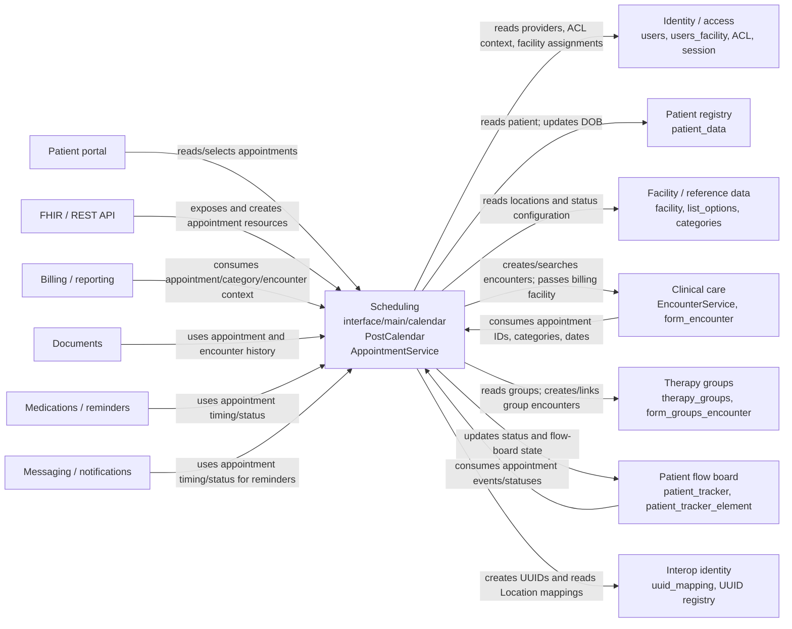

# Scheduling cross-context data access

This inventory covers the legacy calendar under
[`interface/main/calendar/`](../interface/main/calendar/) and the related
appointment libraries and services that it directly calls or exposes. A table
is listed as cross-context when Scheduling uses data whose master record or
business meaning belongs to another area. Appointment tables themselves are
Scheduling-owned and are included only where they are used to reach another
context.

The inventory records confirmed SQL or confirmed delegated calls. It does not
infer access from variable names or from a class dependency that has no
corresponding query/call in the inspected code.

## Cross-context reads and writes

| File and function | Table/data owned elsewhere | Access | What the scheduling code does |
|---|---|---|---|
| [`add_edit_event.php`](../interface/main/calendar/add_edit_event.php), `DOBandEncounter()` | `patient_data` | **Write** | Updates the selected patient's `DOB` when the appointment editor has a patient and DOB value. |
| [`add_edit_event.php`](../interface/main/calendar/add_edit_event.php), event-editor patient lookup | `patient_data` | **Read** | Reads `lname`, `fname`, `phone_home`, `phone_biz`, and `DOB` to display patient information. |
| [`add_edit_event.php`](../interface/main/calendar/add_edit_event.php), existing-event query | `users` | **Read** | Joins `users` to resolve the appointment informant/provider name. |
| [`add_edit_event.php`](../interface/main/calendar/add_edit_event.php), provider/facility defaults | `users`, `facility` | **Read** | Reads the provider's `facility_id` and the facility name when selecting defaults. |
| [`add_edit_event.php`](../interface/main/calendar/add_edit_event.php), provider selector | `users` | **Read** | Lists active authorized providers (`id`, `username`, `fname`, `lname`). |
| [`add_edit_event.php`](../interface/main/calendar/add_edit_event.php), facility selector | `facility` | **Read** | Lists service locations for the appointment and billing-location selectors. |
| [`add_edit_event.php`](../interface/main/calendar/add_edit_event.php), facility correction during event save | `facility` | **Read** | Resolves a provider's facility before assigning an appointment facility. |
| [`add_edit_event.php`](../interface/main/calendar/add_edit_event.php), `DOBandEncounter()` | `form_encounter` | **Indirect write** | Calls `todaysEncounterCheck()` in [`encounter_events.inc.php`](../library/encounter_events.inc.php), which may insert an encounter for a qualifying appointment/check-in. |
| [`add_edit_event.php`](../interface/main/calendar/add_edit_event.php), `DOBandEncounter()` | `form_groups_encounter` | **Indirect write** | Calls `todaysTherapyGroupEncounterCheck()`, which may insert a group encounter. |
| [`add_edit_event.php`](../interface/main/calendar/add_edit_event.php), recurring/provider replacement logic | `form_groups_encounter` | **Write** | Updates `appt_id` when a group appointment event is replaced or relinked. |
| [`add_edit_event.php`](../interface/main/calendar/add_edit_event.php), `DOBandEncounter()` | `patient_tracker`, `patient_tracker_element` | **Indirect read/write** | Calls `manage_tracker_status()` through [`patient_tracker.inc.php`](../library/patient_tracker.inc.php), which reads tracker state and inserts/updates flow-board records. |
| [`pnuserapi.php`](../interface/main/calendar/modules/PostCalendar/pnuserapi.php), `postcalendar_userapi_buildView()` | `patient_data` | **Read** | Joins patient demographics and public ID into rendered calendar events. |
| [`pnuserapi.php`](../interface/main/calendar/modules/PostCalendar/pnuserapi.php), `postcalendar_userapi_buildView()` | `users` | **Read** | Joins provider records for event rendering; the legacy query contains two provider joins. |
| [`pnuserapi.php`](../interface/main/calendar/modules/PostCalendar/pnuserapi.php), calendar filters | `facility` | **Read** | Loads facility IDs/names used by calendar filtering and display. |
| [`pnuserapi.php`](../interface/main/calendar/modules/PostCalendar/pnuserapi.php), `postcalendar_userapi_buildView()` | `therapy_groups` | **Read** | Joins group information when an event has a therapy-group ID. |
| [`find_patient_popup.php`](../interface/main/calendar/find_patient_popup.php), patient search delegation | `patient_data` | **Read** | Delegates name, public-ID, DOB, SSN, and phone searches to patient helpers in [`patient.inc.php`](../library/patient.inc.php). |
| [`find_appt_popup.php`](../interface/main/calendar/find_appt_popup.php), availability query | `patient_data` | **Read** | Uses the appointment query/helper path, which joins patient data while returning appointment records. |
| [`appointments.inc.php`](../library/appointments.inc.php), `fetchEvents()` and related appointment queries | `patient_data` | **Read** | Joins patient demographics/communication fields to appointment and availability results. |
| [`appointments.inc.php`](../library/appointments.inc.php), tracker/appointment reporting queries | `list_options` | **Read** | Reads appointment-status configuration while presenting status information. |
| [`calendar.inc.php`](../library/calendar.inc.php), `getUserFacilities()` | `users`, `users_facility`, `facility` | **Read** | Determines which facilities the current user/provider may see. It reads user identity, facility assignments, and facility records; no scheduling write occurs. |
| [`AppointmentService.php`](../src/Services/AppointmentService.php), `validate()` | `users` | **Read** | Validates that `pc_aid` identifies an existing provider. |
| [`AppointmentService.php`](../src/Services/AppointmentService.php), `validate()` | `patient_data` | **Read** | Validates that `pid` identifies an existing patient. |
| [`AppointmentService.php`](../src/Services/AppointmentService.php), `search()` | `patient_data`, `users`, `facility`, `uuid_mapping` | **Read** | Projects patient, provider, appointment facility, billing location, and Location UUID data into API results. |
| [`AppointmentService.php`](../src/Services/AppointmentService.php), `getAppointmentsForPatient()` | `patient_data`, `users`, `facility`, `uuid_mapping` | **Read** | Returns patient appointment results with patient, provider, facility, billing-location, and UUID data. |
| [`AppointmentService.php`](../src/Services/AppointmentService.php), `getAppointment()` | `patient_data`, `users`, `facility`, `uuid_mapping` | **Read** | Returns one appointment using the same cross-context joins. |
| [`AppointmentService.php`](../src/Services/AppointmentService.php), constructor | `patient_data`, `users`, `facility`, `uuid_mapping` | **Write-capable side effect** | Calls `UuidRegistry::createMissingUuidsForTables()` for appointment, patient, provider, and facility tables; the registry may create missing UUID mappings. |
| [`AppointmentService.php`](../src/Services/AppointmentService.php), `isCheckInStatus()` / `isCheckOutStatus()` | `list_options` | **Read** | Reads `apptstat` option toggle fields to interpret appointment statuses. |
| [`AppointmentService.php`](../src/Services/AppointmentService.php), `getAppointmentStatuses()` / `isValidAppointmentStatus()` | `list_options` | **Read** | Delegates appointment-status lookup/validation to `ListService`, which reads the status options. |
| [`AppointmentService.php`](../src/Services/AppointmentService.php), `updateAppointmentStatus()` | `patient_tracker`, `patient_tracker_element` | **Indirect read/write** | Delegates status changes to `PatientTrackerService::manage_tracker_status()`, which maintains flow-board state. |
| [`AppointmentService.php`](../src/Services/AppointmentService.php), `getEncounterForAppointment()` | encounter data, including `form_encounter` | **Indirect read** | Delegates the patient/date encounter search to `EncounterService`. |
| [`AppointmentService.php`](../src/Services/AppointmentService.php), `createEncounterForAppointment()` | `form_encounter` | **Indirect write** | Builds encounter data including facility and billing facility, then calls `EncounterService::insertEncounter()`. |
| [`encounter_events.inc.php`](../library/encounter_events.inc.php), `todaysEncounterCheck()` | `form_encounter` | **Write** | Inserts date, reason, facility, billing facility, provider, patient, encounter number, category, and place-of-service data for an automatically created encounter. |
| [`encounter_events.inc.php`](../library/encounter_events.inc.php), `todaysTherapyGroupEncounterCheck()` | `form_groups_encounter` | **Write** | Inserts date, reason, facility, billing facility, provider, group, encounter number, appointment ID, and counselors. |
| [`PatientTrackerService.php`](../src/Services/PatientTrackerService.php), `manage_tracker_status()` | `patient_tracker`, `patient_tracker_element` | **Read/write** | Reads the appointment/tracker state, inserts tracker and tracker-element rows, updates `patient_tracker.lastseq`, and records status/room changes. |
| [`pnMod.php`](../interface/main/calendar/includes/pnMod.php), module load/configuration functions | configured PostNuke module metadata tables (`module_vars`, `modules`, with configured prefix) | **Read/write** | The legacy calendar module framework loads module metadata and persists module variables. Physical table names are assembled from the configured prefix in [`pntables.php`](../interface/main/calendar/pntables.php). |

## Billing and encounter boundary

Scheduling stores `pc_billing_location` on its appointment record and resolves
that ID through `facility`. When it creates an encounter, it passes the billing
facility into `form_encounter.billing_facility` or
`form_groups_encounter.billing_facility`. Evidence is in
[`encounter_events.inc.php`](../library/encounter_events.inc.php) and the
appointment projections in [`AppointmentService.php`](../src/Services/AppointmentService.php).

No direct read or write of a charge/claim table named `billing` was found in
[`interface/main/calendar/`](../interface/main/calendar/) or
[`AppointmentService.php`](../src/Services/AppointmentService.php). This does
not mean billing has no dependency on appointments; it means the inspected
Scheduling code crosses that boundary through appointment categories,
encounters, and billing-location facilities rather than directly manipulating
charges or claims.

## Scheduling-owned data excluded from the cross-context list

The following are Scheduling-owned or calendar-module-owned and therefore are
not counted as “data owned by another area”:

- `openemr_postcalendar_events`
- `openemr_postcalendar_categories`
- legacy PostNuke module metadata managed by the calendar framework

The calendar reads and writes appointment events extensively in
[`add_edit_event.php`](../interface/main/calendar/add_edit_event.php),
[`pnuserapi.php`](../interface/main/calendar/modules/PostCalendar/pnuserapi.php),
and [`AppointmentService.php`](../src/Services/AppointmentService.php).

## Context dependency summary

### Scheduling depends on

- **Identity/access:** `users`, `users_facility`, ACL services, active session
  identity, and provider authorization. Evidence:
  [`calendar.inc.php`](../library/calendar.inc.php),
  [`add_edit_event.php`](../interface/main/calendar/add_edit_event.php), and
  [`AclMain.php`](../src/Common/Acl/AclMain.php).
- **Patient registry:** patient identity, demographics, phone numbers, DOB,
  and patient IDs from `patient_data`. Evidence:
  [`patient.inc.php`](../library/patient.inc.php) and
  [`AppointmentService.php`](../src/Services/AppointmentService.php).
- **Facility/reference data:** `facility`, facility assignments, appointment
  categories, and `list_options` status configuration. Evidence:
  [`calendar.inc.php`](../library/calendar.inc.php),
  [`find_appt_popup.php`](../interface/main/calendar/find_appt_popup.php), and
  [`AppointmentService.php`](../src/Services/AppointmentService.php).
- **Clinical care/encounters:** encounter lookup and automatic creation through
  `encounter_events.inc.php` and `EncounterService`.
- **Patient flow/tracking:** tracker state and status transitions through
  [`PatientTrackerService.php`](../src/Services/PatientTrackerService.php).
- **Therapy groups:** group lookup and group-encounter creation through
  [`group.inc.php`](../library/group.inc.php) and
  [`encounter_events.inc.php`](../library/encounter_events.inc.php).
- **Identity/interop UUID mapping:** UUID creation and Location mapping through
  [`UuidRegistry.php`](../src/Common/Uuid/UuidRegistry.php) and
  `uuid_mapping` joins in [`AppointmentService.php`](../src/Services/AppointmentService.php).

### Other contexts depend on Scheduling

- **Patient portal:** portal appointment pages use the appointment service and
  schedule-hour helpers, including
  [`portal/add_edit_event_user.php`](../portal/add_edit_event_user.php) and
  [`portal/find_appt_popup_user.php`](../portal/find_appt_popup_user.php).
- **FHIR/API/interop:** standard and FHIR appointment controllers expose
  appointment data and resolve patient, provider, and facility references via
  [`AppointmentRestController.php`](../src/RestControllers/AppointmentRestController.php)
  and [`FhirAppointmentService.php`](../src/Services/FHIR/FhirAppointmentService.php).
- **Clinical care:** encounter workflows use appointment IDs, categories,
  dates, providers, facilities, and statuses; the Scheduling side can also
  create the encounter records.
- **Patient flow board:** tracker workflows use appointment events and status
  transitions via [`PatientTrackerService.php`](../src/Services/PatientTrackerService.php).
- **Billing/reporting:** fee-sheet, billing-report, and reporting code consumes
  appointment category/event and encounter context. Direct `billing` table
  access from the calendar was not found.
- **Clinical rules, documents, and medication reminders:** confirmed consumers
  include [`clinical_rules.php`](../library/clinical_rules.php),
  [`C_Document.class.php`](../controllers/C_Document.class.php), and
  [`MedEx/API.php`](../library/MedEx/API.php), which use future appointments or
  appointment/encounter context.
- **Messaging/notifications:** reminder and notification code consumes
  appointment timing/status data; the inspected calendar code does not itself
  write messaging tables.

## Mermaid dependency flowchart

The arrows are intentionally labeled with the observed relationship rather
than implying ownership transfer. In particular, Scheduling writes encounter
and tracker records through delegated services/helpers, while the master data
for patients, users, facilities, and status configuration remains outside
Scheduling.

## Limits of the trace

- No direct `billing` charge/claim table access was found in the inspected
  Scheduling files.
- The exact downstream SQL executed by `EncounterService::insertEncounter()`
  was not expanded here; the legacy encounter helper's `form_encounter` and
  `form_groups_encounter` inserts are directly visible.
- Module subscribers and all possible external Composer modules were not
  exhaustively enumerated; this document covers repository code paths found
  from the calendar and appointment-service surfaces.
- `module_vars` and `modules` are dynamically prefixed by the legacy module
  framework, so their physical names depend on the configured table prefix.
