# Patient Management: UML diagrams

- **Status:** Draft for review
- **Part of:** the Patient Management design set (`README.md` in this folder)
- **Depends on:** docs 01 to 07. The diagrams **draw** what those documents describe; where a diagram
  and a document disagree, the document and the code win, and the diagram is the bug.

## 1. How to read this

- **Format:** Mermaid, so the diagrams render on GitHub and stay diff-able. Mermaid has no native UML
  *use case* or *component* diagram, so those two are drawn as flowcharts in the usual UML notation
  (stick-figure actors become rounded boxes, ovals become stadium shapes).
- **Built versus target:** solid boxes are **built**. **Dashed** boxes are **target** (not built). Class
  diagrams mark target members in a `note`, never in a member line.
- **Names** follow the code (`InsuranceCoverage`) and the glossary (doc 02).
- **Not rendered or validated here.** I could not render Mermaid in this environment, so a syntax error
  is possible. Preview the file on GitHub or in an editor and tell me which diagram breaks.

| # | Diagram | UML kind | Shows |
|---|---|---|---|
| D1 | Actors and use cases | Use case | Who does what with the context |
| D2 | Project dependencies | Package / component | Layers and allowed references |
| D3 | Runtime topology | Deployment | Containers, storage, trust boundary |
| D4 | Patient | Class | The `Patient` aggregate (built) |
| D5 | Insurance coverage | Class | The aggregate cluster (built) |
| D6 | Advance directives | Class | Document, status, type (built) |
| D7 | Read models and rules | Class | Read side and pure rules (built) |
| D8 | Use cases, ports, adapters | Class | Hexagonal wiring (built) |
| D9 | Target aggregates | Class | Contacts, relationships, employment, review (target) |
| D10 | Request path | Sequence | Gateway to service, today and target |
| D11 | Swap insurance | Sequence | The two-policy operation |
| D12 | FHIR create | Sequence | The longest built path |
| D13 | Effective coverage query | Sequence | A read through a pure rule |
| D14 | Directive status | State | Status values and review |
| D15 | Outbox message | State | Delivery lifecycle (target relay) |
| D16 | Duplicate score | State | Score values and levels |
| D17 | Insurance policy | State | Derived lifecycle of a policy |
| D18 | Effective-insurance rule | Activity | The decision logic |
| D19 | Registration | Activity | Validation and persistence steps |
| D20 | Legacy tables used (built) | Entity relationship | What is read and written |
| D21 | Legacy tables (target) | Entity relationship | Tables the target model adds |
| D22 | Domain event flow | Communication | Commands to events to consumers |

## 2. Use cases and structure

### D1. Actors and use cases

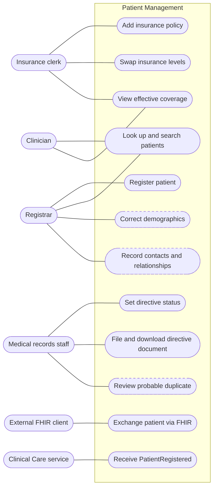
```mermaid
flowchart LR
    REG(["Registrar"])
    CLK(["Insurance clerk"])
    REC(["Medical records staff"])
    CLN(["Clinician"])
    EXT(["External FHIR client"])
    CC(["Clinical Care service"])

    subgraph SYS["Patient Management"]
        UC1(["Register patient"])
        UC2(["Look up and search patients"])
        UC3(["Add insurance policy"])
        UC4(["Swap insurance levels"])
        UC5(["View effective coverage"])
        UC6(["Set directive status"])
        UC7(["File and download directive document"])
        UC8(["Exchange patient via FHIR"])
        UC9(["Correct demographics"])
        UC10(["Record contacts and relationships"])
        UC11(["Review probable duplicate"])
        UC12(["Receive PatientRegistered"])
    end

    REG --- UC1
    REG --- UC2
    REG --- UC9
    REG --- UC10
    CLK --- UC3
    CLK --- UC4
    CLK --- UC5
    REC --- UC6
    REC --- UC7
    REC --- UC11
    CLN --- UC2
    CLN --- UC5
    EXT --- UC8
    CC --- UC12

    classDef target stroke-dasharray: 5 5
    class UC9,UC10,UC11 target
```

`UC9`, `UC10`, `UC11` are target. `UC12` is built on the producing side only: the event is written but
nothing delivers it yet (doc 05, F-6). Register also **includes** a duplicate-scoring step (doc 05,
WF-1).

### D2. Project dependencies

Arrows point from the project that **references** to the one it **depends on**. Read from the csproj
files. `Client` and `Composition` reference nothing.

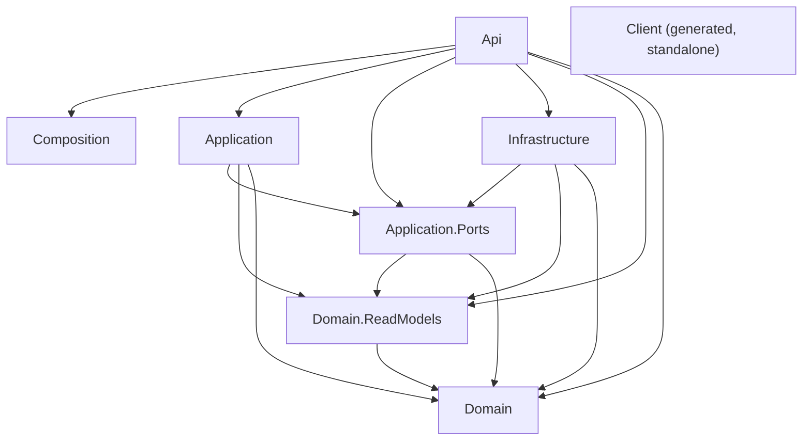
```mermaid
flowchart TB
    API["Api"]
    COMP["Composition"]
    APP["Application"]
    PORTS["Application.Ports"]
    INFRA["Infrastructure"]
    RM["Domain.ReadModels"]
    DOM["Domain"]
    CLIENT["Client (generated, standalone)"]

    API --> COMP
    API --> APP
    API --> PORTS
    API --> INFRA
    API --> RM
    API --> DOM
    APP --> PORTS
    APP --> RM
    APP --> DOM
    INFRA --> PORTS
    INFRA --> RM
    INFRA --> DOM
    PORTS --> RM
    PORTS --> DOM
    RM --> DOM
```

Enforced by `LayerDependencyTests`: `Domain` references nothing of this service; `Application` does not
reference `Infrastructure` or `Api`; `Infrastructure` does not reference `Application` or `Api`. `Api`
referencing `Infrastructure` is the composition root wiring adapters to ports, which is allowed.

### D3. Runtime topology

From `docker-compose.yml` and the ADRs cited. Dotted boxes are one-shot setup containers.

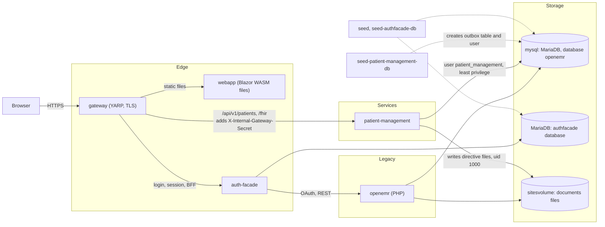
```mermaid
flowchart LR
    BROWSER["Browser"]

    subgraph EDGE["Edge"]
        GW["gateway (YARP, TLS)"]
        WEB["webapp (Blazor WASM files)"]
        AF["auth-facade"]
    end

    subgraph SVC["Services"]
        PM["patient-management"]
    end

    subgraph LEG["Legacy"]
        OE["openemr (PHP)"]
    end

    subgraph STORE["Storage"]
        DB[("mysql: MariaDB, database openemr")]
        AFDB[("MariaDB: authfacade database")]
        VOL[("sitesvolume: documents files")]
    end

    SEED1["seed-patient-management-db"]
    SEED2["seed, seed-authfacade-db"]

    BROWSER -->|HTTPS| GW
    GW -->|static files| WEB
    GW -->|login, session, BFF| AF
    GW -->|"/api/v1/patients, /fhir<br/>adds X-Internal-Gateway-Secret"| PM
    AF -->|OAuth, REST| OE
    AF --> AFDB
    OE --> DB
    OE --> VOL
    PM -->|"user patient_management, least privilege"| DB
    PM -->|"writes directive files, uid 1000"| VOL
    SEED1 -.->|"creates outbox table and user"| DB
    SEED2 -.-> DB
    SEED2 -.-> AFDB
```

Trust boundary: **everything left of `PM` is reachable by a browser**, and the only protection on the
patient routes is the secret the Gateway itself attaches (doc 03, M1). `PM` and `OE` share the same
database and the same files volume (doc 06).

## 3. Class diagrams (built)

### D4. Patient

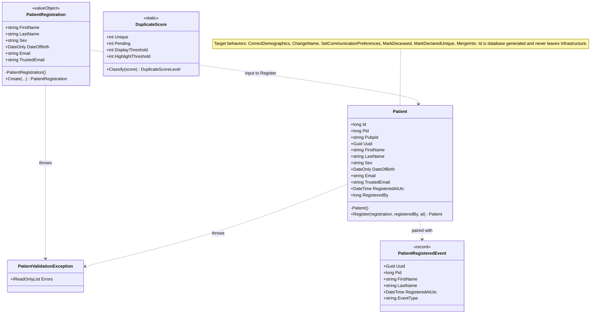
```mermaid
classDiagram
    class Patient {
      +long Id
      +long Pid
      +string Pubpid
      +Guid Uuid
      +string FirstName
      +string LastName
      +string Sex
      +DateOnly DateOfBirth
      +string Email
      +string TrustedEmail
      +DateTime RegisteredAtUtc
      +long RegisteredBy
      -Patient()
      +Register(registration, registeredBy, at) Patient
    }
    class PatientRegistration {
      <<valueObject>>
      +string FirstName
      +string LastName
      +string Sex
      +DateOnly DateOfBirth
      +string Email
      +string TrustedEmail
      -PatientRegistration()
      +Create(...) PatientRegistration
    }
    class PatientValidationException {
      +IReadOnlyList Errors
    }
    class PatientRegisteredEvent {
      <<record>>
      +Guid Uuid
      +long Pid
      +string FirstName
      +string LastName
      +DateTime RegisteredAtUtc
      +string EventType
    }
    class DuplicateScore {
      <<static>>
      +int Unique
      +int Pending
      +int DisplayThreshold
      +int HighlightThreshold
      +Classify(score) DuplicateScoreLevel
    }

    PatientRegistration ..> Patient : input to Register
    PatientRegistration ..> PatientValidationException : throws
    Patient ..> PatientValidationException : throws
    Patient ..> PatientRegisteredEvent : paired with
    note for Patient "Target behaviors: CorrectDemographics, ChangeName, SetCommunicationPreferences, MarkDeceased, MarkDeclaredUnique, MergeInto. Id is database generated and never leaves Infrastructure."
```

### D5. Insurance coverage cluster

`~` marks `internal`: callable only inside `Domain` (and by `Infrastructure` through
`InternalsVisibleTo`). That is the mechanism that keeps the cluster rule from being bypassed.

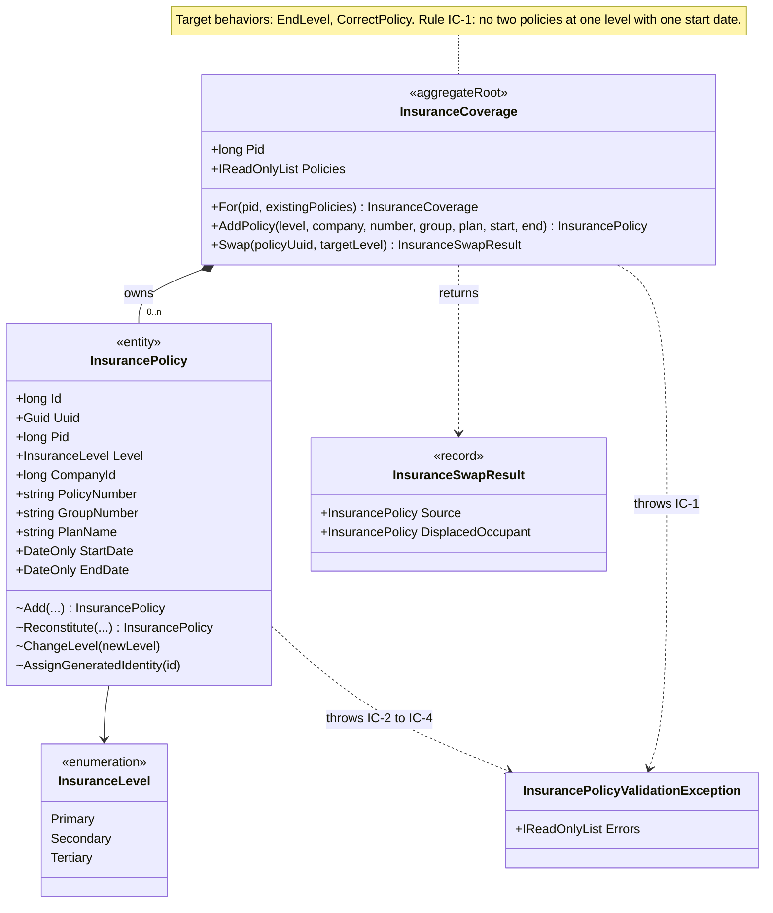
```mermaid
classDiagram
    class InsuranceCoverage {
      <<aggregateRoot>>
      +long Pid
      +IReadOnlyList Policies
      +For(pid, existingPolicies) InsuranceCoverage
      +AddPolicy(level, company, number, group, plan, start, end) InsurancePolicy
      +Swap(policyUuid, targetLevel) InsuranceSwapResult
    }
    class InsurancePolicy {
      <<entity>>
      +long Id
      +Guid Uuid
      +long Pid
      +InsuranceLevel Level
      +long CompanyId
      +string PolicyNumber
      +string GroupNumber
      +string PlanName
      +DateOnly StartDate
      +DateOnly EndDate
      ~Add(...) InsurancePolicy
      ~Reconstitute(...) InsurancePolicy
      ~ChangeLevel(newLevel)
      ~AssignGeneratedIdentity(id)
    }
    class InsuranceLevel {
      <<enumeration>>
      Primary
      Secondary
      Tertiary
    }
    class InsuranceSwapResult {
      <<record>>
      +InsurancePolicy Source
      +InsurancePolicy DisplacedOccupant
    }
    class InsurancePolicyValidationException {
      +IReadOnlyList Errors
    }

    InsuranceCoverage *-- "0..n" InsurancePolicy : owns
    InsurancePolicy --> InsuranceLevel
    InsuranceCoverage ..> InsuranceSwapResult : returns
    InsuranceCoverage ..> InsurancePolicyValidationException : throws IC-1
    InsurancePolicy ..> InsurancePolicyValidationException : throws IC-2 to IC-4
    note for InsuranceCoverage "Target behaviors: EndLevel, CorrectPolicy. Rule IC-1: no two policies at one level with one start date."
```

### D6. Advance directives

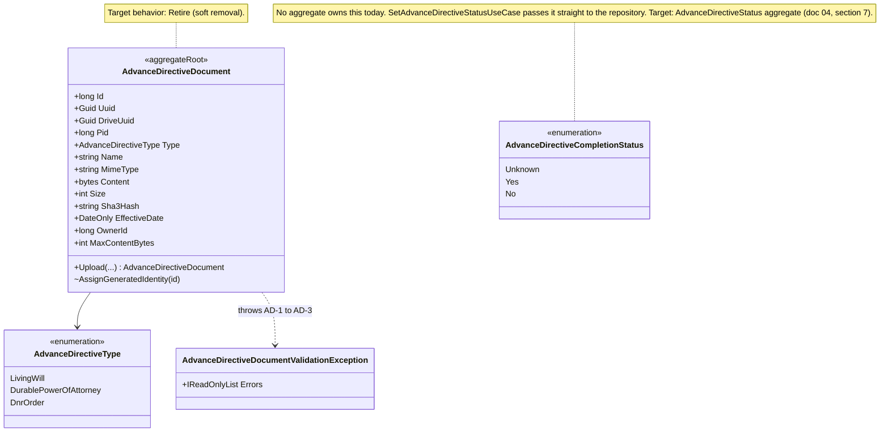
```mermaid
classDiagram
    class AdvanceDirectiveDocument {
      <<aggregateRoot>>
      +long Id
      +Guid Uuid
      +Guid DriveUuid
      +long Pid
      +AdvanceDirectiveType Type
      +string Name
      +string MimeType
      +bytes Content
      +int Size
      +string Sha3Hash
      +DateOnly EffectiveDate
      +long OwnerId
      +int MaxContentBytes
      +Upload(...) AdvanceDirectiveDocument
      ~AssignGeneratedIdentity(id)
    }
    class AdvanceDirectiveType {
      <<enumeration>>
      LivingWill
      DurablePowerOfAttorney
      DnrOrder
    }
    class AdvanceDirectiveCompletionStatus {
      <<enumeration>>
      Unknown
      Yes
      No
    }
    class AdvanceDirectiveDocumentValidationException {
      +IReadOnlyList Errors
    }

    AdvanceDirectiveDocument --> AdvanceDirectiveType
    AdvanceDirectiveDocument ..> AdvanceDirectiveDocumentValidationException : throws AD-1 to AD-3
    note for AdvanceDirectiveCompletionStatus "No aggregate owns this today. SetAdvanceDirectiveStatusUseCase passes it straight to the repository. Target: AdvanceDirectiveStatus aggregate (doc 04, section 7)."
    note for AdvanceDirectiveDocument "Target behavior: Retire (soft removal)."
```

### D7. Read models and pure rules

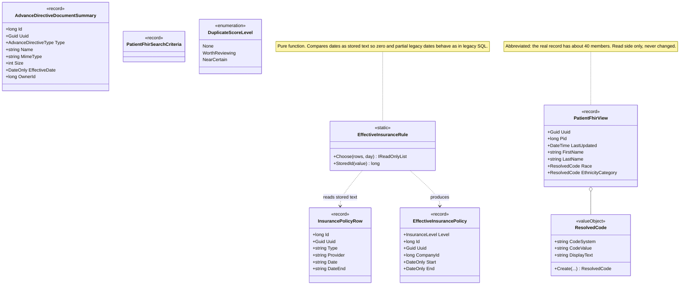
```mermaid
classDiagram
    class EffectiveInsuranceRule {
      <<static>>
      +Choose(rows, day) IReadOnlyList
      +StoredId(value) long
    }
    class InsurancePolicyRow {
      <<record>>
      +long Id
      +Guid Uuid
      +string Type
      +string Provider
      +string Date
      +string DateEnd
    }
    class EffectiveInsurancePolicy {
      <<record>>
      +InsuranceLevel Level
      +long Id
      +Guid Uuid
      +long CompanyId
      +DateOnly Start
      +DateOnly End
    }
    class AdvanceDirectiveDocumentSummary {
      <<record>>
      +long Id
      +Guid Uuid
      +AdvanceDirectiveType Type
      +string Name
      +string MimeType
      +int Size
      +DateOnly EffectiveDate
      +long OwnerId
    }
    class PatientFhirView {
      <<record>>
      +Guid Uuid
      +long Pid
      +DateTime LastUpdated
      +string FirstName
      +string LastName
      +ResolvedCode Race
      +ResolvedCode EthnicityCategory
    }
    class PatientFhirSearchCriteria {
      <<record>>
    }
    class ResolvedCode {
      <<valueObject>>
      +string CodeSystem
      +string CodeValue
      +string DisplayText
      +Create(...) ResolvedCode
    }
    class DuplicateScoreLevel {
      <<enumeration>>
      None
      WorthReviewing
      NearCertain
    }

    EffectiveInsuranceRule ..> InsurancePolicyRow : reads stored text
    EffectiveInsuranceRule ..> EffectiveInsurancePolicy : produces
    PatientFhirView o-- ResolvedCode
    note for EffectiveInsuranceRule "Pure function. Compares dates as stored text so zero and partial legacy dates behave as in legacy SQL."
    note for PatientFhirView "Abbreviated: the real record has about 40 members. Read side only, never changed."
```

### D8. Use cases, ports, and adapters

Hexagonal wiring. Every arrow between layers points **inward** to the port. The domain appears only as
arguments and results.

```mermaid
classDiagram
    class RegisterPatientUseCase {
      <<useCase>>
    }
    class ScorePatientForDuplicatesUseCase {
      <<useCase>>
    }
    class AddInsurancePolicyUseCase {
      <<useCase>>
    }
    class SwapInsuranceUseCase {
      <<useCase>>
    }
    class GetEffectiveInsuranceUseCase {
      <<useCase>>
    }
    class UploadAdvanceDirectiveDocumentUseCase {
      <<useCase>>
    }
    class DownloadAdvanceDirectiveDocumentUseCase {
      <<useCase>>
    }
    class GetAdvanceDirectiveDocumentsUseCase {
      <<useCase>>
    }
    class SetAdvanceDirectiveStatusUseCase {
      <<useCase>>
    }
    class GetAdvanceDirectiveStatusUseCase {
      <<useCase>>
    }
    class GetPatientFhirRecordUseCase {
      <<useCase>>
    }
    class SearchPatientFhirRecordsUseCase {
      <<useCase>>
    }

    class IPatientRegistry {
      <<port>>
      +RegisterAsync(patient, event)
    }
    class IDuplicateScorer {
      <<port>>
      +RescoreAsync(pid) int
    }
    class IInsurancePolicyRepository {
      <<port>>
      +AddAsync(policy)
      +GetRowsAsync(pid)
      +GetPoliciesAsync(pid)
      +PersistSwapAsync(result)
    }
    class IAdvanceDirectiveRepository {
      <<port>>
      +AddDocumentAsync(document)
      +GetDocumentsAsync(pid)
      +GetDocumentContentAsync(pid, uuid)
      +SetStatusAsync(...)
      +GetStatusAsync(pid)
    }
    class IPatientFhirRepository {
      <<port>>
      +GetByUuidAsync(uuid)
      +SearchAsync(criteria)
    }

    class EfPatientRegistry {
      <<adapter>>
    }
    class EfDuplicateScorer {
      <<adapter>>
    }
    class EfInsurancePolicyRepository {
      <<adapter>>
    }
    class EfAdvanceDirectiveRepository {
      <<adapter>>
    }
    class EfPatientFhirRepository {
      <<adapter>>
    }
    class IAdvanceDirectiveFileStore {
      <<internalInterface>>
    }
    class LocalDiskAdvanceDirectiveFileStore {
      <<adapter>>
    }
    class PatientManagementDbContext {
      <<efCore>>
    }

    RegisterPatientUseCase --> IPatientRegistry
    ScorePatientForDuplicatesUseCase --> IDuplicateScorer
    AddInsurancePolicyUseCase --> IInsurancePolicyRepository
    SwapInsuranceUseCase --> IInsurancePolicyRepository
    GetEffectiveInsuranceUseCase --> IInsurancePolicyRepository
    UploadAdvanceDirectiveDocumentUseCase --> IAdvanceDirectiveRepository
    DownloadAdvanceDirectiveDocumentUseCase --> IAdvanceDirectiveRepository
    GetAdvanceDirectiveDocumentsUseCase --> IAdvanceDirectiveRepository
    SetAdvanceDirectiveStatusUseCase --> IAdvanceDirectiveRepository
    GetAdvanceDirectiveStatusUseCase --> IAdvanceDirectiveRepository
    GetPatientFhirRecordUseCase --> IPatientFhirRepository
    SearchPatientFhirRecordsUseCase --> IPatientFhirRepository

    EfPatientRegistry ..|> IPatientRegistry
    EfDuplicateScorer ..|> IDuplicateScorer
    EfInsurancePolicyRepository ..|> IInsurancePolicyRepository
    EfAdvanceDirectiveRepository ..|> IAdvanceDirectiveRepository
    EfPatientFhirRepository ..|> IPatientFhirRepository
    LocalDiskAdvanceDirectiveFileStore ..|> IAdvanceDirectiveFileStore
    EfAdvanceDirectiveRepository --> IAdvanceDirectiveFileStore

    EfPatientRegistry --> PatientManagementDbContext
    EfDuplicateScorer --> PatientManagementDbContext
    EfInsurancePolicyRepository --> PatientManagementDbContext
    EfAdvanceDirectiveRepository --> PatientManagementDbContext
    EfPatientFhirRepository --> PatientManagementDbContext
```

Which endpoint group calls which use case:

| Endpoint group | Use cases |
|---|---|
| `PatientEndpoints` | `RegisterPatientUseCase`, `ScorePatientForDuplicatesUseCase`, `SearchPatientFhirRecordsUseCase`, `GetPatientFhirRecordUseCase` |
| `InsuranceEndpoints` | `AddInsurancePolicyUseCase`, `SwapInsuranceUseCase`, `GetEffectiveInsuranceUseCase` |
| `AdvanceDirectiveEndpoints` | Upload, Download, GetDocuments, SetStatus, GetStatus |
| `FhirPatientEndpoints` | `RegisterPatientUseCase`, `ScorePatientForDuplicatesUseCase`, `GetPatientFhirRecordUseCase`, `SearchPatientFhirRecordsUseCase` |

Note the two scoring callers: both sit in `Api`, after the registration transaction (doc 05, F-1).

## 4. Class diagram (target)

### D9. Target aggregates

Not built. References between aggregates are **by identifier** (dotted), never by object.

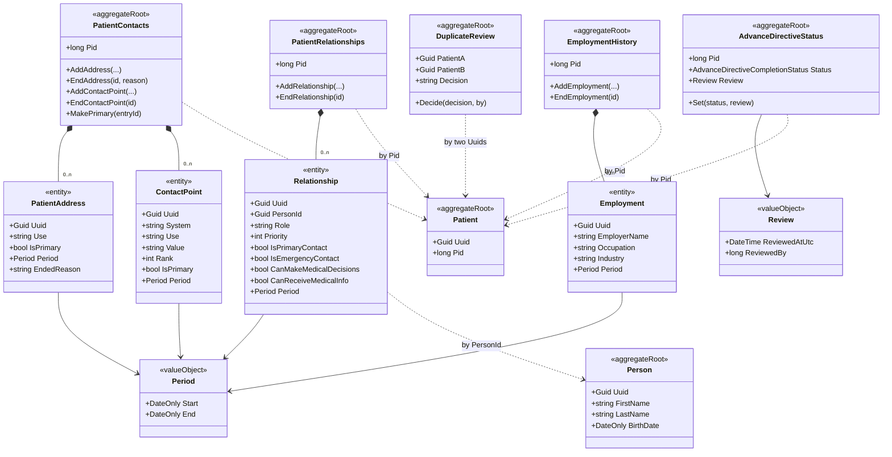
```mermaid
classDiagram
    class Patient {
      <<aggregateRoot>>
      +Guid Uuid
      +long Pid
    }
    class PatientContacts {
      <<aggregateRoot>>
      +long Pid
      +AddAddress(...)
      +EndAddress(id, reason)
      +AddContactPoint(...)
      +EndContactPoint(id)
      +MakePrimary(entryId)
    }
    class PatientAddress {
      <<entity>>
      +Guid Uuid
      +string Use
      +bool IsPrimary
      +Period Period
      +string EndedReason
    }
    class ContactPoint {
      <<entity>>
      +Guid Uuid
      +string System
      +string Use
      +string Value
      +int Rank
      +bool IsPrimary
      +Period Period
    }
    class Period {
      <<valueObject>>
      +DateOnly Start
      +DateOnly End
    }
    class Person {
      <<aggregateRoot>>
      +Guid Uuid
      +string FirstName
      +string LastName
      +DateOnly BirthDate
    }
    class PatientRelationships {
      <<aggregateRoot>>
      +long Pid
      +AddRelationship(...)
      +EndRelationship(id)
    }
    class Relationship {
      <<entity>>
      +Guid Uuid
      +Guid PersonId
      +string Role
      +int Priority
      +bool IsPrimaryContact
      +bool IsEmergencyContact
      +bool CanMakeMedicalDecisions
      +bool CanReceiveMedicalInfo
      +Period Period
    }
    class EmploymentHistory {
      <<aggregateRoot>>
      +long Pid
      +AddEmployment(...)
      +EndEmployment(id)
    }
    class Employment {
      <<entity>>
      +Guid Uuid
      +string EmployerName
      +string Occupation
      +string Industry
      +Period Period
    }
    class AdvanceDirectiveStatus {
      <<aggregateRoot>>
      +long Pid
      +AdvanceDirectiveCompletionStatus Status
      +Review Review
      +Set(status, review)
    }
    class Review {
      <<valueObject>>
      +DateTime ReviewedAtUtc
      +long ReviewedBy
    }
    class DuplicateReview {
      <<aggregateRoot>>
      +Guid PatientA
      +Guid PatientB
      +string Decision
      +Decide(decision, by)
    }

    PatientContacts *-- "0..n" PatientAddress
    PatientContacts *-- "0..n" ContactPoint
    PatientAddress --> Period
    ContactPoint --> Period
    PatientRelationships *-- "0..n" Relationship
    Relationship --> Period
    EmploymentHistory *-- "0..n" Employment
    Employment --> Period
    AdvanceDirectiveStatus --> Review

    PatientContacts ..> Patient : by Pid
    PatientRelationships ..> Patient : by Pid
    Relationship ..> Person : by PersonId
    EmploymentHistory ..> Patient : by Pid
    AdvanceDirectiveStatus ..> Patient : by Pid
    DuplicateReview ..> Patient : by two Uuids
```

## 5. Sequence diagrams

### D10. Request path through the Gateway

**Today.** No sign-in is required on this path (doc 03, M1):

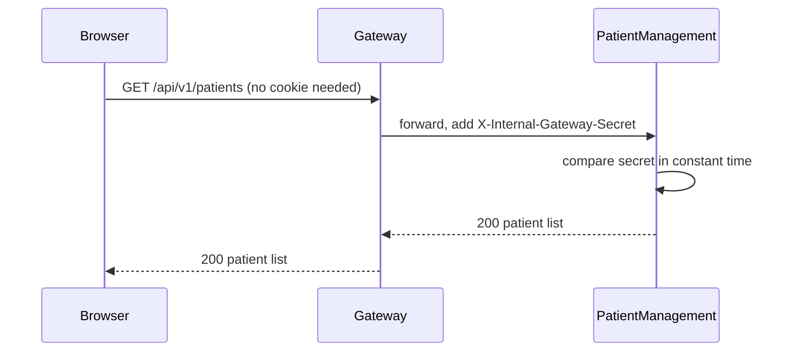
```mermaid
sequenceDiagram
    participant B as Browser
    participant G as Gateway
    participant P as PatientManagement
    B->>G: GET /api/v1/patients (no cookie needed)
    G->>P: forward, add X-Internal-Gateway-Secret
    P->>P: compare secret in constant time
    P-->>G: 200 patient list
    G-->>B: 200 patient list
```

**Target (forward authentication, doc 07 P0-1).** The Gateway asks AuthFacade before routing:

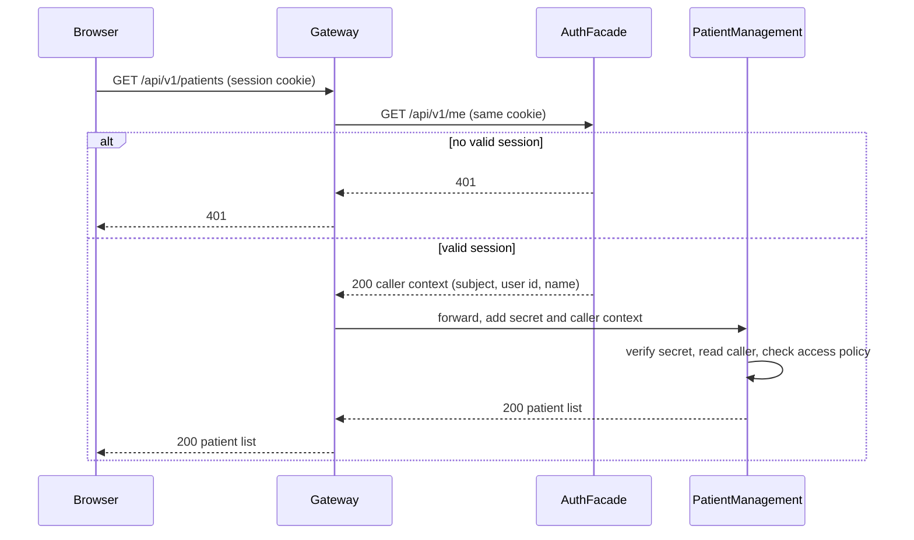
```mermaid
sequenceDiagram
    participant B as Browser
    participant G as Gateway
    participant A as AuthFacade
    participant P as PatientManagement
    B->>G: GET /api/v1/patients (session cookie)
    G->>A: GET /api/v1/me (same cookie)
    alt no valid session
        A-->>G: 401
        G-->>B: 401
    else valid session
        A-->>G: 200 caller context (subject, user id, name)
        G->>P: forward, add secret and caller context
        P->>P: verify secret, read caller, check access policy
        P-->>G: 200 patient list
        G-->>B: 200 patient list
    end
```

### D11. Swap insurance levels

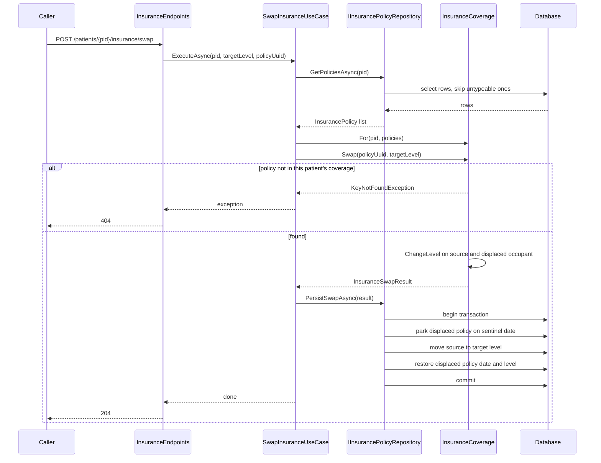
```mermaid
sequenceDiagram
    participant C as Caller
    participant E as InsuranceEndpoints
    participant U as SwapInsuranceUseCase
    participant R as IInsurancePolicyRepository
    participant V as InsuranceCoverage
    participant D as Database
    C->>E: POST /patients/{pid}/insurance/swap
    E->>U: ExecuteAsync(pid, targetLevel, policyUuid)
    U->>R: GetPoliciesAsync(pid)
    R->>D: select rows, skip untypeable ones
    D-->>R: rows
    R-->>U: InsurancePolicy list
    U->>V: For(pid, policies)
    U->>V: Swap(policyUuid, targetLevel)
    alt policy not in this patient's coverage
        V-->>U: KeyNotFoundException
        U-->>E: exception
        E-->>C: 404
    else found
        V->>V: ChangeLevel on source and displaced occupant
        V-->>U: InsuranceSwapResult
        U->>R: PersistSwapAsync(result)
        R->>D: begin transaction
        R->>D: park displaced policy on sentinel date
        R->>D: move source to target level
        R->>D: restore displaced policy date and level
        R->>D: commit
        U-->>E: done
        E-->>C: 204
    end
```

### D12. FHIR create

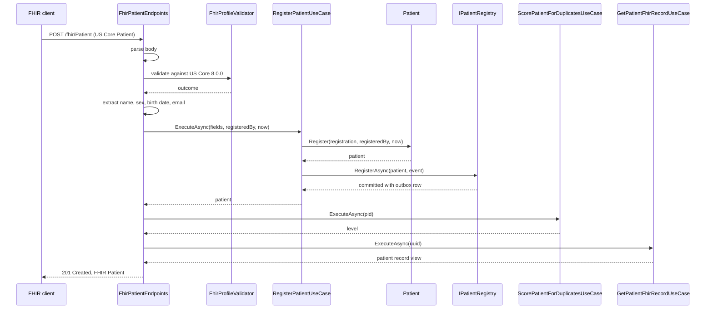
```mermaid
sequenceDiagram
    participant C as FHIR client
    participant E as FhirPatientEndpoints
    participant F as FhirProfileValidator
    participant U as RegisterPatientUseCase
    participant Pa as Patient
    participant R as IPatientRegistry
    participant S as ScorePatientForDuplicatesUseCase
    participant G as GetPatientFhirRecordUseCase
    C->>E: POST /fhir/Patient (US Core Patient)
    E->>E: parse body
    E->>F: validate against US Core 8.0.0
    F-->>E: outcome
    E->>E: extract name, sex, birth date, email
    E->>U: ExecuteAsync(fields, registeredBy, now)
    U->>Pa: Register(registration, registeredBy, now)
    Pa-->>U: patient
    U->>R: RegisterAsync(patient, event)
    R-->>U: committed with outbox row
    U-->>E: patient
    E->>S: ExecuteAsync(pid)
    S-->>E: level
    E->>G: ExecuteAsync(uuid)
    G-->>E: patient record view
    E-->>C: 201 Created, FHIR Patient
```

The scoring step after the commit is the defect in doc 05, F-1: a failure there returns an error for a
patient that already exists.

### D13. Effective coverage query

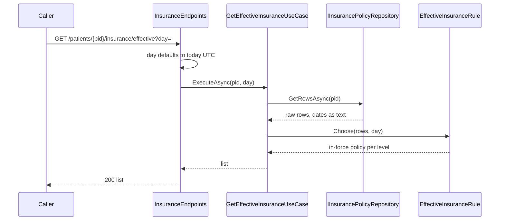
```mermaid
sequenceDiagram
    participant C as Caller
    participant E as InsuranceEndpoints
    participant U as GetEffectiveInsuranceUseCase
    participant R as IInsurancePolicyRepository
    participant X as EffectiveInsuranceRule
    C->>E: GET /patients/{pid}/insurance/effective?day=
    E->>E: day defaults to today UTC
    E->>U: ExecuteAsync(pid, day)
    U->>R: GetRowsAsync(pid)
    R-->>U: raw rows, dates as text
    U->>X: Choose(rows, day)
    X-->>U: in-force policy per level
    U-->>E: list
    E-->>C: 200 list
```

## 6. State diagrams

### D14. Directive status

Legacy's column default is `NO`, so a **new patient starts as No**, not Unknown. Any value can be set
from any other. Unknown (stored as the empty string) is a deliberate third value.

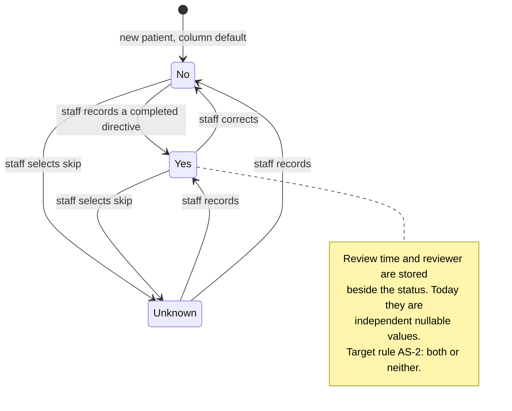
```mermaid
stateDiagram-v2
    [*] --> No : new patient, column default
    No --> Yes : staff records a completed directive
    Yes --> No : staff corrects
    No --> Unknown : staff selects skip
    Yes --> Unknown : staff selects skip
    Unknown --> Yes : staff records
    Unknown --> No : staff records
    note right of Yes
        Review time and reviewer are stored
        beside the status. Today they are
        independent nullable values.
        Target rule AS-2: both or neither.
    end note
```

### D15. Outbox message (target relay)

Today a row is written and stays **Pending forever**: nothing reads it (doc 05, F-6).

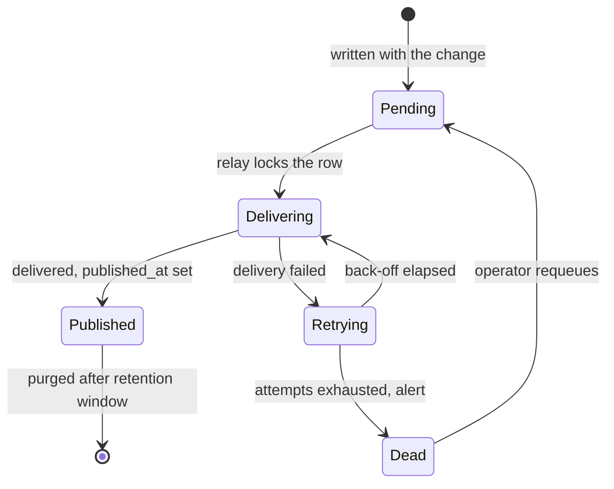
```mermaid
stateDiagram-v2
    [*] --> Pending : written with the change
    Pending --> Delivering : relay locks the row
    Delivering --> Published : delivered, published_at set
    Delivering --> Retrying : delivery failed
    Retrying --> Delivering : back-off elapsed
    Retrying --> Dead : attempts exhausted, alert
    Published --> [*] : purged after retention window
    Dead --> Pending : operator requeues
```

### D16. Duplicate score

`dupscore` holds a number with two reserved values. The score is a derived cache. The reserved values
are legacy's encoding; the domain sees a level and a flag (doc 04, 4.6).

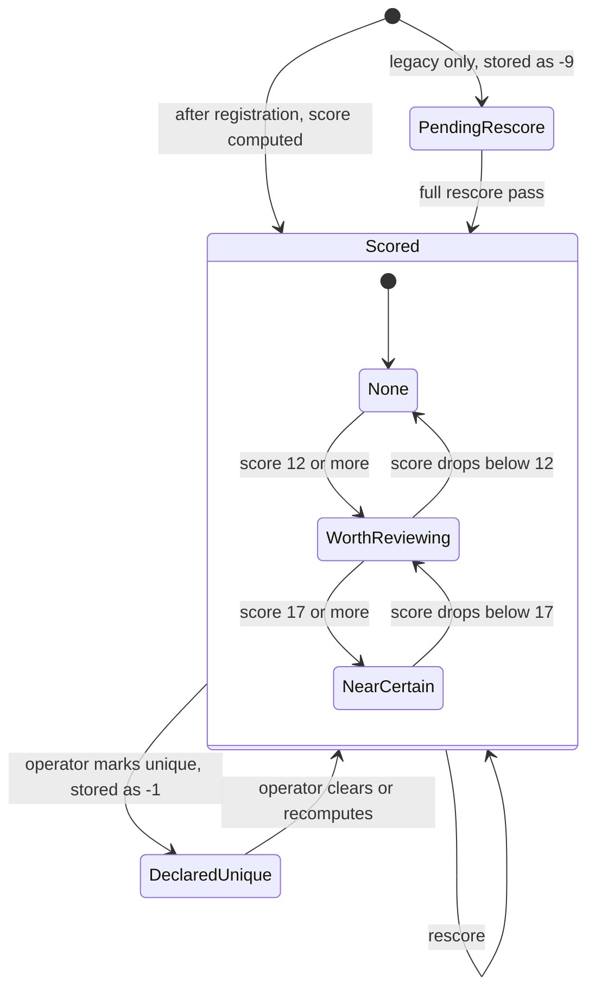
```mermaid
stateDiagram-v2
    [*] --> Scored : after registration, score computed
    state Scored {
        [*] --> None
        None --> WorthReviewing : score 12 or more
        WorthReviewing --> NearCertain : score 17 or more
        NearCertain --> WorthReviewing : score drops below 17
        WorthReviewing --> None : score drops below 12
    }
    Scored --> Scored : rescore
    Scored --> DeclaredUnique : operator marks unique, stored as -1
    DeclaredUnique --> Scored : operator clears or recomputes
    [*] --> PendingRescore : legacy only, stored as -9
    PendingRescore --> Scored : full rescore pass
```

`PendingRescore` is produced only by legacy tooling. The built scorer never writes it, and the built
scorer excludes patients stored as unique from comparisons.

### D17. Insurance policy (derived)

A policy's state is **not stored**. It is derived from its dates and from the other policies at its
level by `EffectiveInsuranceRule`. Only the level is ever changed, by a swap.

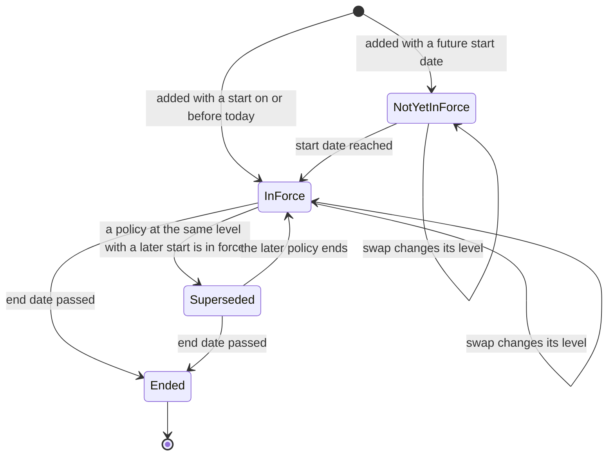
```mermaid
stateDiagram-v2
    [*] --> NotYetInForce : added with a future start date
    [*] --> InForce : added with a start on or before today
    NotYetInForce --> InForce : start date reached
    InForce --> Superseded : a policy at the same level with a later start is in force
    Superseded --> InForce : the later policy ends
    InForce --> Ended : end date passed
    Superseded --> Ended : end date passed
    Ended --> [*]
    InForce --> InForce : swap changes its level
    NotYetInForce --> NotYetInForce : swap changes its level
```

## 7. Activity diagrams

### D18. Effective-insurance rule

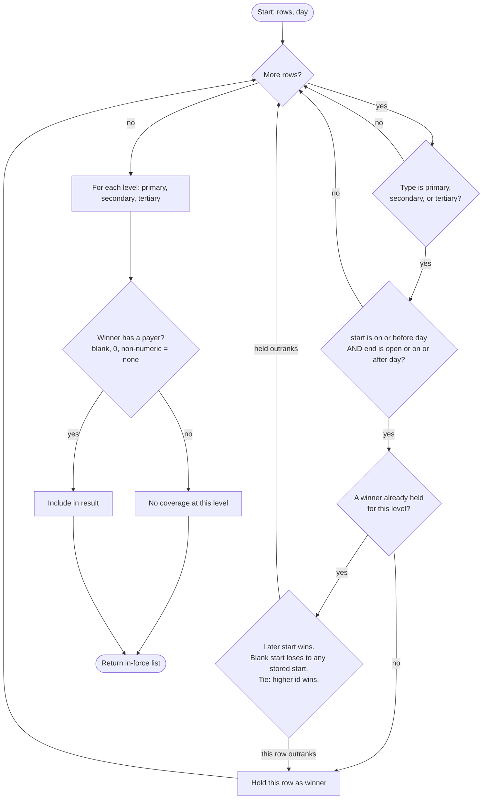
```mermaid
flowchart TD
    S(["Start: rows, day"]) --> NEXT{"More rows?"}
    NEXT -- no --> LV["For each level: primary, secondary, tertiary"]
    NEXT -- yes --> T{"Type is primary,<br/>secondary, or tertiary?"}
    T -- no --> NEXT
    T -- yes --> RNG{"start is on or before day<br/>AND end is open or on or after day?"}
    RNG -- no --> NEXT
    RNG -- yes --> HELD{"A winner already held<br/>for this level?"}
    HELD -- no --> SET["Hold this row as winner"]
    HELD -- yes --> CMP{"Later start wins.<br/>Blank start loses to any stored start.<br/>Tie: higher id wins."}
    CMP -- this row outranks --> SET
    CMP -- held outranks --> NEXT
    SET --> NEXT
    LV --> PAY{"Winner has a payer?<br/>blank, 0, non-numeric = none"}
    PAY -- no --> NOCOV["No coverage at this level"]
    PAY -- yes --> INC["Include in result"]
    NOCOV --> DONE(["Return in-force list"])
    INC --> DONE
```

### D19. Registration

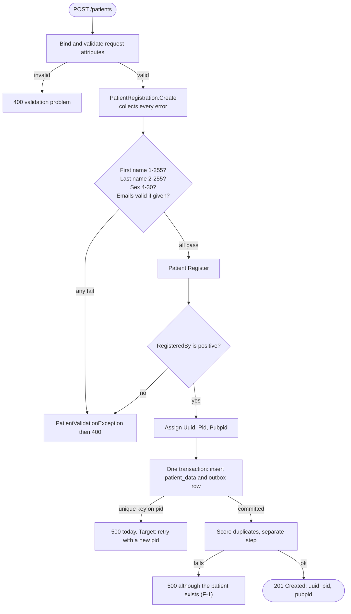
```mermaid
flowchart TD
    S(["POST /patients"]) --> BIND["Bind and validate request attributes"]
    BIND -- invalid --> R400A["400 validation problem"]
    BIND -- valid --> CRE["PatientRegistration.Create<br/>collects every error"]
    CRE --> CH1{"First name 1-255?<br/>Last name 2-255?<br/>Sex 4-30?<br/>Emails valid if given?"}
    CH1 -- any fail --> R400B["PatientValidationException then 400"]
    CH1 -- all pass --> REG["Patient.Register"]
    REG --> CH2{"RegisteredBy is positive?"}
    CH2 -- no --> R400B
    CH2 -- yes --> ID["Assign Uuid, Pid, Pubpid"]
    ID --> TX["One transaction: insert patient_data and outbox row"]
    TX -- unique key on pid --> E500["500 today. Target: retry with a new pid"]
    TX -- committed --> SC["Score duplicates, separate step"]
    SC -- fails --> E500B["500 although the patient exists (F-1)"]
    SC -- ok --> OK(["201 Created: uuid, pid, pubpid"])
```

## 8. Entity-relationship diagrams

Legacy declares **no foreign keys** (`docs/m2-schema-inventory.md`), so every relationship below is
**logical**, kept by convention on `pid`.

### D20. Legacy tables used today

```mermaid
erDiagram
    patient_data {
        bigint id
        bigint pid UK
        varchar pubpid
        binary16 uuid UK
        varchar fname
        varchar lname
        varchar sex
        date DOB
        varchar email
        varchar email_direct
        datetime regdate
        datetime date
        bigint created_by
        bigint updated_by
        int dupscore
        varchar completed_ad
        datetime ad_reviewed
        bigint advance_directive_user_authenticator
        int providerID
    }
    insurance_data {
        bigint id
        binary16 uuid
        bigint pid
        varchar type
        varchar provider
        varchar policy_number
        varchar group_number
        varchar plan_name
        date date
        date date_end
    }
    documents {
        bigint id
        binary16 uuid
        binary16 drive_uuid
        bigint foreign_id
        varchar name
        varchar mimetype
        int size
        varchar url
        varchar hash
        bigint owner
        int deleted
    }
    categories {
        bigint id
        varchar name
    }
    categories_to_documents {
        bigint category_id
        bigint document_id
    }
    sequences {
        bigint id
    }
    patient_management_outbox {
        bigint id PK
        varchar event_type
        longtext payload
        datetime occurred_at
        datetime published_at
    }
    users {
        bigint id
        binary16 uuid
    }
    list_options {
        varchar list_id
        varchar option_id
        varchar notes
        varchar codes
    }

    patient_data ||--o{ insurance_data : "pid, unique with type and date"
    patient_data ||--o{ documents : "foreign_id equals pid"
    documents ||--o{ categories_to_documents : "document_id"
    categories ||--o{ categories_to_documents : "category_id"
    users ||--o{ patient_data : "providerID"
```

`sequences` is related to `documents` only by convention: `documents.id` is drawn from it. The outbox
relates to nothing by key; its rows name a patient only inside the payload. Unique constraints shown are
the ones this service relies on (`pid`, `uuid`, and `(pid, type, date)` on `insurance_data`). Columns
are the ones this service reads or writes, not the full tables (`patient_data` has 132).

### D21. Legacy tables the target model adds

```mermaid
erDiagram
    patient_data {
        bigint pid UK
        bigint id
    }
    employer_data {
        bigint id
        binary16 uuid
        bigint pid
        varchar name
        text occupation
        text industry
        datetime start_date
        datetime end_date
    }
    patient_history {
        bigint id
        bigint pid
        text previous_name_first
        text previous_name_last
        date previous_name_enddate
    }
    contact {
        bigint id
        varchar foreign_table_name
        bigint foreign_id
    }
    contact_address {
        bigint contact_id
        bigint address_id
        varchar use
        char is_primary
        datetime period_start
        datetime period_end
        varchar inactivated_reason
    }
    addresses {
        bigint id
    }
    contact_telecom {
        bigint contact_id
        varchar system
        varchar use
        varchar value
        int rank
        char is_primary
        datetime period_start
        datetime period_end
    }
    person {
        bigint id
        binary16 uuid
        varchar first_name
        varchar last_name
        date birth_date
    }
    contact_relation {
        bigint contact_id
        varchar target_table
        bigint target_id
        varchar role
        varchar relationship
        int contact_priority
        boolean is_primary_contact
        boolean is_emergency_contact
        boolean can_make_medical_decisions
        boolean can_receive_medical_info
    }
    person_patient_link {
        bigint person_id
        bigint patient_id
        boolean active
    }

    patient_data ||--o{ employer_data : "pid"
    patient_data ||--o{ patient_history : "pid"
    contact ||--o{ contact_address : "contact_id"
    addresses ||--o{ contact_address : "address_id"
    contact ||--o{ contact_telecom : "contact_id"
    contact ||--o{ contact_relation : "contact_id"
    person ||--o{ contact : "foreign_table_name person, foreign_id"
    patient_data ||--o{ contact_relation : "target_table patient_data, target_id"
    person ||--o{ person_patient_link : "person_id"
    patient_data ||--o{ person_patient_link : "patient_id"
```

The `contact` table is polymorphic: `foreign_table_name` and `foreign_id` point at a `person` or at a
`patient_data` row, with no key to enforce it. Whether legacy actually populates these tables for
patients, or only the columns on `patient_data`, is **unverified** (doc 04, 8.4; doc 07, section 7).

## 9. Communication

### D22. Domain event flow

Commands (left) change one aggregate each and produce events (middle); only events with a known
consumer leave the service (right). Dashed is target.

```mermaid
flowchart LR
    subgraph CMD["Commands"]
        C1["Register patient"]
        C2["Correct demographics"]
        C3["Add policy"]
        C4["Swap levels"]
        C5["Set directive status"]
        C6["Upload directive document"]
    end

    subgraph AGG["Aggregates"]
        A1["Patient"]
        A2["InsuranceCoverage"]
        A3["AdvanceDirectiveStatus"]
        A4["AdvanceDirectiveDocument"]
    end

    subgraph EVT["Domain events, written to the outbox"]
        E1["PatientRegistered"]
        E2["PatientDemographicsCorrected"]
        E3["InsurancePolicyAdded"]
        E4["InsuranceLevelsSwapped"]
        E5["AdvanceDirectiveStatusSet"]
        E6["AdvanceDirectiveDocumentFiled"]
    end

    subgraph CON["Consumers"]
        RS["Internal rescore handler"]
        CC["Clinical Care"]
        BL["Billing and Claims"]
        AU["Audit store"]
    end

    C1 --> A1 --> E1
    C2 --> A1
    A1 --> E2
    C3 --> A2 --> E3
    C4 --> A2
    A2 --> E4
    C5 --> A3 --> E5
    C6 --> A4 --> E6

    E1 --> RS
    E1 --> CC
    E2 --> RS
    E2 --> CC
    E3 --> BL
    E4 --> BL
    E5 --> CC
    E1 --> AU
    E2 --> AU
    E3 --> AU
    E4 --> AU
    E5 --> AU
    E6 --> AU

    classDef target stroke-dasharray: 5 5
    class C2,A3,E2,E3,E4,E5,E6,RS,CC,BL,AU target
```

Solid is built: the five commands `C1`, `C3` to `C6`, the aggregates `A1`, `A2`, `A4`, and the one event
`PatientRegistered`, which is written to the outbox but delivered to nobody. Dashed is target. Note what
the dashes reveal: the commands for add policy, swap, set status, and upload **are built but write no
event** (doc 05, F-5), so the whole event column for them is dashed. `A3` is dashed because directive
status has no aggregate today (doc 04, section 7).
